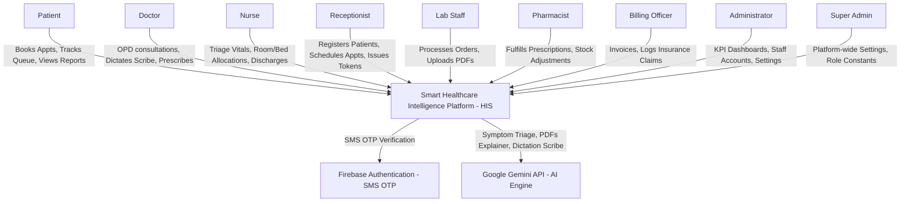
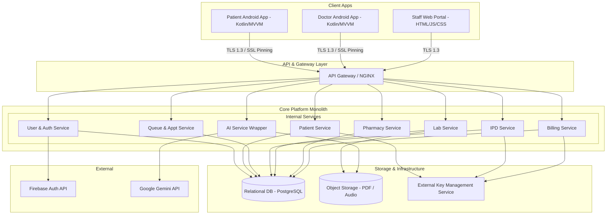

# System Architecture Document
## Smart Healthcare Intelligence Platform v1.0

⚠️ **STACK DEVIATION:** `Technical_Requirements.md` does not exist in the project workspace. The technology stack, constraints, and ciphers defined in this architecture are derived directly from [Blueprint.md](file:///c:/Users/sm223/OneDrive/Desktop/Smart%20Healthcare%20Management%20System/documents/Blueprint.md) and [Security_Requirements.md](file:///c:/Users/sm223/OneDrive/Desktop/Smart%20Healthcare%20Management%20System/documents/Security_Requirements.md).

---

## 1. Architecture Style

### Pattern Chosen: Modular Monolith
The platform is designed as a **Modular Monolith**. The application runs as a single deployable process, but the codebase is strictly separated into logical, independent modules with defined API interfaces:
*   `UserModule` (Auth, Session, & RBAC validation)
*   `PatientModule` (UHID generation, Profile management, Consent settings)
*   `QueueModule` (Appointments, Token generation, Polling queues)
*   `IPDModule` (Admissions, Ward Bed allocations, Discharge tracking)
*   `LabModule` (Orders creation, processing transitions, PDF upload/archive)
*   `PharmacyModule` (Fulfillments, Local Stock counts, Expiries)
*   `BillingModule` (Itemized invoices, Manual insurance claim tracking)
*   `AIModule` (Gemini API wrappers for Symptom Chat, Report Explainer, and Scribe)

### Justification
1.  **Team Size:** The hospital IT team is small. Managing a modular monolith requires minimal deployment and operations overhead compared to a distributed microservices cluster.
2.  **Timeline:** Phase 1 requires rapid MVP delivery. A monolith simplifies debugging, sharing schemas, and local environment setups, accelerating deployment.
3.  **Local Scale:** The platform operates primarily inside a single hospital infrastructure. Local web portals and clinical apps benefit from low-latency, in-process communications rather than RPC/HTTP network calls across nodes.
4.  **Future Migration path:** Clean modular boundaries allow individual services (e.g. AI Scribe or Queue Tracking) to be easily extracted into standalone microservices in future phases (Phase 2-5) if processing bottlenecks occur.

### Tradeoffs Accepted
*   **Single Process Deployment:** A fatal crash (e.g. out-of-memory error caused by an audio file upload in the AI module) will temporarily take down the entire application, including critical services like Queue and Admissions.
*   **Monolithic Scaling:** The entire monolith must be scaled horizontally as a single unit. We cannot scale the compute-heavy AI service independently of the lightweight Registration service.
*   **Database Level Coupling:** While modules communicate via internal APIs, they share a single physical Relational Database. Developers must adhere to strict schema access patterns (no direct foreign keys between modules; queries must go through module interfaces) to prevent database spaghetti.

---

## 2. System Context Diagram (C4 Context Level)



---

## 3. Component Architecture (C4 Container Level)



### Component Details

1.  **Patient Android App:**
    *   *Technology:* Native Kotlin, MVVM architecture, SQLCipher (local encrypted SQLite cache).
    *   *Responsibility:* Patient self-service portal (bookings, queue status tracking, report downloading).
    *   *Inputs:* User touch inputs, Firebase OTP SMS, API responses.
    *   *Outputs:* Parameterized HTTP requests to API Gateway, encrypted local cache writes.
    *   *Failure Behaviour:* Falls back to local cached token and layout; displays a persistent "Active Connection Required" warning banner; blocks booking submissions.

2.  **Doctor Android App:**
    *   *Technology:* Native Kotlin, MVVM architecture, Android Recording SDK.
    *   *Responsibility:* Doctor consult dashboard, progress notes entry, and dictation voice recorder.
    *   *Inputs:* Voice dictation input, touch inputs, patient history JSON.
    *   *Outputs:* Multipart audio file uploads, digital prescriptions JSON.
    *   *Failure Behaviour:* Displays offline warning; allows local drafting of progress notes; blocks digital prescription and audio uploading.

3.  **Staff Web Portal:**
    *   *Technology:* SPA using HTML5, Vanilla JavaScript, and Vanilla CSS.
    *   *Responsibility:* Multi-role terminal for receptionists, nurses, lab staff, pharmacists, billing, and administrators.
    *   *Inputs:* Keyboard/mouse inputs, barcode scanner, CSV stock logs, PDF uploads.
    *   *Outputs:* HTTP requests with JWT/Session Cookies, file upload payloads.
    *   *Failure Behaviour:* Web page becomes unresponsive or displays HTTP 504 Gateway Timeout; blocks all operational registration and fulfillment workflows.

4.  **API Gateway (NGINX):**
    *   *Technology:* NGINX Reverse Proxy.
    *   *Responsibility:* Enforces TLS 1.3 SSL termination, rate limiting, and routes requests to backend modules.
    *   *Inputs:* Raw TCP/IP client requests, SSL certificates.
    *   *Outputs:* Decrypted internal HTTP requests routed to backend services.
    *   *Failure Behaviour:* Entire system goes offline. Clients receive connection refused errors.

5.  **Backend Application (Modular Monolith):**
    *   *Technology:* Node.js or Python backend runtime.
    *   *Responsibility:* Runs the core business logic services (User, Patient, Queue, IPD, Lab, Pharmacy, Billing, AI Service Wrapper).
    *   *Inputs:* Internal HTTP request payloads from NGINX.
    *   *Outputs:* JSON response payloads, database queries, external API payloads.
    *   *Failure Behaviour:* Clients receive HTTP 500 Internal Server Error or 502 Bad Gateway responses.

6.  **Relational Database:**
    *   *Technology:* PostgreSQL (with AES-256 volume encryption).
    *   *Responsibility:* Persistent relational storage for all hospital transactions, users, and logs.
    *   *Inputs:* SQL queries (SELECT, INSERT, UPDATE, DELETE).
    *   *Outputs:* Structured database row arrays, transaction logs.
    *   *Failure Behaviour:* Backend services transition to read-only or error states; active operations halt immediately.

7.  **Object Storage:**
    *   *Technology:* MinIO or AWS S3-compatible local bucket storage.
    *   *Responsibility:* Stores PDF lab reports and clinical voice dictation audio files.
    *   *Inputs:* File binary streams from Lab and AI modules.
    *   *Outputs:* File download streams, temporary pre-signed HTTP URLs.
    *   *Failure Behaviour:* Lab report uploads fail; patients cannot retrieve report PDFs; doctor voice scribing fails.

8.  **External KMS:**
    *   *Technology:* HashiCorp Vault or Cloud KMS.
    *   *Responsibility:* Manages and serves encryption keys for Application Field-Level Encryption (FLE).
    *   *Inputs:* Decryption/Encryption API calls.
    *   *Outputs:* Data Encryption Keys (DEKs).
    *   *Failure Behaviour:* System is unable to encrypt new patient files or decrypt existing records; clinical workspaces display decryption errors.

---

## 4. Data Flow (P0 Use Cases)

### F-REG-01: Patient Registration and UHID Generation
*   **Happy Path:** Receptionist submits registration form -> Web Portal executes POST `/api/patients` -> API Gateway checks rate limits and routes to `Patient Service` -> Service generates `UHID-YYYY-XXXXXX` sequentially -> Service encrypts PII via KMS keys -> Service executes DB transaction to insert row in `Patients` -> returns HTTP 201 with generated UHID.
*   **Failure Path:** Database connection is lost mid-transaction -> `Patient Service` rolls back the query -> returns HTTP 500 Internal Server Error -> Web Portal displays "System unavailable, please try again" banner.

### F-OPD-01: Appointment Scheduling
*   **Happy Path:** Patient selects date/time -> App calls POST `/api/appointments` -> `Queue Service` verifies timeslot availability in `Appointments` table -> Service inserts appointment record -> returns HTTP 201 Confirmation.
*   **Failure Path (Concurrency Race):** Two patients click book on the same slot simultaneously -> DB transaction executes write lock on the slot -> First write succeeds; second write triggers a duplicate key/constraint validation failure -> `Queue Service` rolls back the second transaction and returns HTTP 409 Conflict -> Client App displays "Slot no longer available."

### F-OPD-03: Queue Token Generation
*   **Happy Path:** Receptionist clicks check-in -> Portal calls POST `/api/queues/tokens` -> `Queue Service` validates appointment status -> Generates sequential token number -> Appends token to Doctor's active waitlist -> DB updates appointment status to "Checked-In" -> returns HTTP 201 Token details.
*   **Failure Path:** Attending doctor has no active schedule/roster -> `Queue Service` rejects creation -> returns HTTP 400 Bad Request with message "Selected doctor is not rostered today."

### F-OPD-05: Patient Vital Signs Recording (Triage)
*   **Happy Path:** Nurse inputs vitals -> Web Portal calls POST `/api/triage/vitals` -> `Patient Service` validates numeric ranges -> Service encrypts vital values via KMS -> Service writes row to `Consultations` (vitals fields) -> returns HTTP 201 Success.
*   **Failure Path:** Nurse enters alphabetic character in heart rate field -> Web Portal input validation fails before sending API call -> blocks submit and displays "Must be a number" UI alert.

### F-DOC-02: Consultation Workspace Notes
*   **Happy Path:** Doctor opens consultation -> Workspace queries `/api/consultations/{id}` -> `Doctor Service` decodes PHI details -> Doctor writes diagnosis and saves -> calls PUT `/api/consultations/{id}` -> Service saves notes -> returns HTTP 200 Success.
*   **Failure Path:** KMS decryption fails due to network dropout -> `Doctor Service` cannot decrypt patient chronic conditions -> blocks UI, returns HTTP 503 Service Unavailable, and triggers critical KMS system alert.

### F-DOC-03: Digital Prescription System
*   **Happy Path:** Doctor searches formulary -> App calls GET `/api/medicines` -> Doctor adds dosage details -> calls POST `/api/prescriptions` -> `Doctor Service` writes to `Prescriptions` table linked to Consultation ID -> returns HTTP 210 Success.
*   **Failure Path:** Doctor attempts to prescribe a medicine not present in the standard formulary (`Medicines` table) -> `Doctor Service` rejects the transaction -> returns HTTP 422 Unprocessable Entity.

### F-IPD-01: Inpatient Admission Management
*   **Happy Path:** Nurse queries vacant beds -> App calls GET `/api/beds?status=Available` -> Nurse selects bed and creates admission -> calls POST `/api/admissions` -> `IPD Service` creates record in `Admissions` table and updates `Beds` status to "Occupied" -> returns HTTP 201.
*   **Failure Path:** The selected bed status was updated to "Occupied" by another nurse a second prior -> DB transaction fails constraint check -> returns HTTP 409 Conflict with message "Bed is occupied."

### F-IPD-03: Patient Discharge Management
*   **Happy Path:** Nurse executes discharge -> App calls POST `/api/admissions/{id}/discharge` -> `IPD Service` sets status to "Discharged", releases the bed (status set to "Cleaning/Maintenance"), and calls `Billing Service` to compile ward stay charges -> returns HTTP 200.
*   **Failure Path:** `Billing Service` fails to calculate invoice charges due to server timeout -> `IPD Service` completes the bed status update to ensure physical ward operations are not blocked, but writes a critical mismatch log in `AuditLogs` for billing reconciliation.

### F-LAB-02: Lab Workflow Processing
*   **Happy Path:** Lab Staff transitions status -> Portal calls PUT `/api/lab/orders/{id}/status` -> `Lab Service` writes status change and timestamp to `Reports` table -> returns HTTP 200.
*   **Failure Path:** Lab Staff attempts to skip transition (e.g. from "Requested" directly to "Completed" without "Sample Collected") -> `Lab Service` validation rules reject the request -> returns HTTP 400 Bad Request.

### F-LAB-03: Digital Report PDF Upload
*   **Happy Path:** Lab Staff uploads PDF -> App calls POST `/api/lab/reports/upload` -> NGINX routes to `Lab Service` -> PDF stream is written to a temporary folder -> malware scanner executes -> scan passes -> file is written to `Object Storage` -> URL is saved in `Reports` database table -> returns HTTP 201.
*   **Failure Path:** Malware scanner flags the PDF file -> `Lab Service` deletes the temporary file -> writes a critical security warning to `AuditLogs` -> returns HTTP 400 Malicious File Detected.

### F-PHR-01: Prescription Fulfillment
*   **Happy Path:** Pharmacist clicks Fulfill -> Portal calls POST `/api/pharmacy/prescriptions/{id}/fulfill` -> `Pharmacy Service` checks stock counts in `InventoryLogs` -> stock is sufficient -> Service decrements stock count -> updates prescription status to "Dispensed" -> returns HTTP 200.
*   **Failure Path:** Medicine stock count is zero in the database -> `Pharmacy Service` checks stock count -> constraint fails -> blocks dispensing and returns HTTP 422 Out of Stock.

### F-BIL-01: Invoicing & Billing Engine
*   **Happy Path:** Billing Officer queries charges -> Portal calls GET `/api/billing/patients/{uhid}/charges` -> `Billing Service` aggregates consultation fee, lab fees, and room bed charges -> Officer clicks print and pay -> calls POST `/api/billing/invoices` -> DB writes record -> returns HTTP 201.
*   **Failure Path:** A lab report is still in "Processing" status and has no cost yet -> `Billing Service` excludes it from the invoice -> Billing Officer manually inputs the charge before saving.

### F-BIL-02: Manual Insurance Claim Logging
*   **Happy Path:** Billing Officer inputs policy details -> Portal calls POST `/api/billing/claims` -> `Billing Service` writes details to claims fields in `Invoices` table with status "Pending" -> returns HTTP 201.
*   **Failure Path (Authorization):** A Receptionist tries to log an insurance claim -> API Gateway validates user's JWT role -> Receptionist role does not possess write access to billing -> Gateway blocks request -> returns HTTP 403 Forbidden.

### F-SEC-01: Patient Authentication (SMS OTP)
*   **Happy Path:** Patient enters phone number -> Firebase sends OTP SMS -> Patient inputs code -> App calls Firebase SDK to verify -> Firebase returns user token -> App sends token to server POST `/api/auth/patients` -> `User Service` validates token, creates/matches Patient record, and opens session -> returns HTTP 200.
*   **Failure Path:** Patient inputs incorrect OTP code -> Firebase SDK rejects verification -> Patient App blocks token dispatch to server, displaying "Invalid Code" UI alert.

### F-SEC-02: Staff Authentication & RBAC
*   **Happy Path:** Staff enters credentials -> Portal calls POST `/api/auth/staff` -> `User Service` verifies email exists and hashes password -> password hashes match -> Service creates session ID, writes session to Redis/Memory, and sets Cookie header with HttpOnly/SameSite/Secure -> returns user role and redirects.
*   **Failure Path:** Attacker tries brute force -> 5 consecutive authentication failures occur -> `User Service` locks account in Redis for 15 minutes -> subsequent attempts return HTTP 423 Locked.

### F-SEC-03: Data Access Auditing
*   **Happy Path:** User reads patient record -> Service calls `Audit Service` -> Service writes log entry (User ID, IP, Action, Timestamp) to `AuditLogs` table -> DB write completes -> returns data.
*   **Failure Path:** Database write to `AuditLogs` fails (e.g. disk space full) -> `Audit Service` throws exception -> Core transactional service catches exception and rolls back the primary data read/write operation -> returns HTTP 500.

### F-ADM-01: Hospital Staff Configuration
*   **Happy Path:** Administrator inputs staff details -> calls POST `/api/admin/staff` -> `User Service` writes to `Users` table and configures RBAC privileges -> returns HTTP 201.
*   **Failure Path:** Administrator inputs a duplicate email address -> `User Service` checks email uniqueness -> database constraint fails -> returns HTTP 409 Conflict.

---

## 5. Infrastructure and Scalability

### Hosting Topology
```
[Internet/Cellular]
       │
       ▼ (HTTPS / Port 443 / TLS 1.3)
 ┌───────────┐
 │   NGINX   │ (Rate Limiter / SSL Pinning Validation)
 └─────┬─────┘
       │ (HTTP / Localhost)
 ┌─────▼──────────────────────────────┐
 │       Backend Application          │ (Modular Monolith)
 └─────┬──────────────┬──────────────┬┘
       │              │              │
 ┌─────▼─────┐  ┌─────▼─────┐  ┌─────▼─────┐
 │PostgreSQL │  │   MinIO   │  │HashiCorp  │
 │ Database  │  │ (Object)  │  │ Vault KMS │ (Local On-Premise LAN)
 └───────────┘  └───────────┘  └───────────┘
```
The platform is deployed as a **Hybrid Infrastructure**:
*   **On-Premise Server Rack:** Hosted inside the hospital data room. Runs the NGINX gateway, Backend Monolith, PostgreSQL database, and MinIO object storage. This ensures low-latency operations for the Web Portal and staff clinical interfaces even if external internet connections fail.
*   **Secure External Connections:** Outgoing TLS 1.3 connections route requests to Firebase Auth APIs and Google Gemini endpoints over WAN.

### Inter-Component Communication
*   **Synchronous REST over HTTPS:** Used for all standard CRUD requests, authentication checks, billing, and queue management.
*   **Asynchronous Tasks (In-Memory Workers):** Used for non-blocking operations:
    *   Sending PDF documents to Gemini API (Report Explainer).
    *   Processing and converting voice dictation audio files (Medical Scribe).
    *   Running nightly database maintenance and audit log compressions.

### Caching Strategy
*   **Cache Store:** Redis or Local In-Memory Cache (e.g. Node-Cache).
*   **Cached Items:** Standard drug formulary (`Medicines` table), Doctor listings, Department metadata, and static UI routes.
*   **Time-to-Live (TTL):** 24 hours.
*   **Invalidation Policy:** Write-through invalidation. When an Administrator modifies the drug formulary or a doctor's schedule, the backend updates the database and explicitly evicts the corresponding cache key.

### Background Jobs
1.  **Expiry Monitoring Job:** Runs daily at 01:00 AM. Queries `InventoryLogs` for medicines where `expiry_date` is < 30 days. Generates alerts.
2.  **Reorder Alert Job:** Runs hourly. Checks if stock counts fall below reorder thresholds. Sends notifications to the Pharmacist dashboard.
3.  **Audit Log Compression:** Runs weekly. Compresses logs older than 90 days into secure archive zip files stored in MinIO.

---

## 6. Mobile Architecture

### Pattern: MVVM (Model-View-ViewModel)
The Patient and Doctor applications are built using the native **Android MVVM** pattern:
*   **View Layer (XML/Jetpack Compose):** Handles UI rendering only. Binds to ViewModels using reactive bindings.
*   **ViewModel Layer:** Manages UI state, handles user interactions, and calls Repositories.
*   **Model Layer (Repository & Local DB):** Coordinates data fetching from local cache or remote APIs.

### State Management
*   **Kotlin Coroutines & Flow/StateFlow:** StateFlow coordinates reactive updates between Repositories, ViewModels, and Compose UI screens, ensuring that network changes trigger UI state modifications instantly.

### Offline Strategy
*   **Connection State:** Online-only with local UI caching.
*   **Local Caching:** Encrypted SQLite (via SQLCipher) cache stores the last fetched data (e.g. active queue token, upcoming appointments, and PDF lab reports).
*   **Offline Operation Bounds:**
    *   *Read-Only Cache:* If internet connection is lost, users can view previously cached appointments and download already cached PDFs.
    *   *No Offline Write Queue:* Booking appointments, canceling slots, dictating voice summaries, and registering for tokens are disabled offline. The UI blocks the submit actions and displays an offline error banner.
    *   *No Sync Conflicts:* Since write operations are disabled offline, there is no need for synchronization conflict resolution.

### Top-Level Navigation Structure
*   **Patient App:**
    1.  `DashboardFragment` (Upcoming appointments, quick shortcuts)
    2.  `QueueTrackingFragment` (Live wait list status and polling counter)
    3.  `ReportsListFragment` (List of lab reports and PDF downloads)
    4.  `SymptomAssistantFragment` (Symptom triaging chat view)
*   **Doctor App:**
    1.  `ScheduleFragment` (Chronological appointments and check-ins)
    2.  `PatientSearchFragment` (Search patient medical history)
    3.  `VoiceScribeFragment` (Dictation recording and SOAP note output)

---

## 7. Failure Modes and Resilience

| Component | Failure Scenario | System Behaviour | Recovery Mechanism |
| :--- | :--- | :--- | :--- |
| **API Gateway (NGINX)** | Process crashes or stops responding. | Complete system outage; clients receive connection timeouts. | Monitored by local systemd daemon; automatically restarts process upon crash detection. |
| **PostgreSQL Database** | DB disk space exhausted. | Monolith transitions to read-only; write transactions fail. | DB writes roll back; admin receives system page alert; disk cleanups trigger automatic recovery. |
| **Firebase Auth** | Firebase API experiences outage or SMS block. | Patients cannot log in; existing active sessions continue. | App displays "Authentication Service Unavailable; please try later" banner. |
| **Google Gemini API** | Gemini service is rate-limited or times out. | Scribe, report explaining, and symptom triage chats fail. | Monolith catches API timeout; displays "AI assistant is busy; retrying..." message; uses exponential backoff retry. |
| **MinIO Storage** | Object storage disk goes offline. | PDF lab reports cannot be uploaded or downloaded. | Lab report status updates are queued; once MinIO mounts, files are re-uploaded. |

### Data Consistency Guarantees
*   **Strong Consistency:** Enforced for all clinical transactions (Consultations, Prescriptions, Lab Orders, Admissions, and Invoices) and security audit trails (`AuditLogs`). These transactions write synchronously to the Relational Database.
*   **Eventual Consistency:** Tolerated for operational analytics charts, dashboard KPIs, and predictive forecasting analytics.

---

## 8. Architecture Decision Records (ADRs)

### ADR-01: Modular Monolith vs. Microservices
*   **Context:** The development timeline is short (Phase 1), the hospital IT engineering team is small, and deployments are local on-premise servers.
*   **Options Considered:**
    1.  *Modular Monolith (Chosen):* Build a single deployable process divided into clean, decoupled modules communicating via in-process calls.
    2.  *Microservices:* Deconstruct the application into 8 independent service processes running in Docker containers communicating via HTTP REST or gRPC.
*   **Tradeoffs:**
    *   *Modular Monolith:* Simplifies local testing, builds, deployment pipelines, and database transactions. However, if one module crashes the host process, all services fail.
    *   *Microservices:* High operational overhead, complex distributed transaction tracing, and resource constraints on host servers.
*   **Decision:** Modular Monolith selected due to team size constraints and deployment simplicity.

### ADR-02: HTTPS Polling vs. WebSockets for Queue Tracking
*   **Context:** Patients require waiting queue updates. WebSockets provide real-time updates but maintain stateful TCP connections.
*   **Options Considered:**
    1.  *30-Second HTTP Polling (Chosen):* Client app requests queue state every 30 seconds.
    2.  *WebSockets:* Stateful open connection routing live updates.
*   **Tradeoffs:**
    *   *HTTP Polling:* Simple to implement, stateless, and runs over NGINX gateway without complex connection configurations. However, updates are delayed up to 30 seconds.
    *   *WebSockets:* Real-time push capability, but exposes the hospital server to high persistent resource usage.
*   **Decision:** HTTP Polling selected to minimize connection overhead on the on-premise infrastructure.

### ADR-03: Firebase Authentication for Patients vs. Local Password Database
*   **Context:** Secure patient identification is required. Managing passwords on mobile devices is a high support overhead.
*   **Options Considered:**
    1.  *Firebase SMS OTP Authentication (Chosen):* Leverages Firebase infrastructure to send and verify SMS verification codes.
    2.  *Local Username/Password Database:* Enforces username and password credentials.
*   **Tradeoffs:**
    *   *Firebase OTP:* Bypasses password management, verifies phone number ownership, but introduces an external runtime dependency.
    *   *Local Database:* Complete control over credentials, but increases database security risks and requires building password reset workflows.
*   **Decision:** Firebase SMS OTP selected to simplify user onboarding and security controls.
