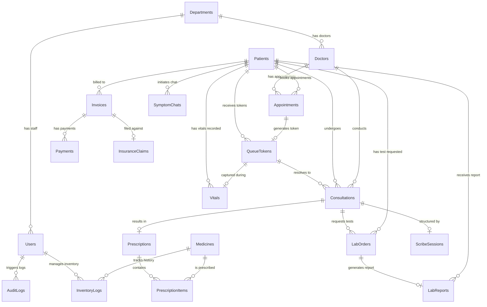

# Database Schema Document
## Smart Healthcare Intelligence Platform v1.0

Modelling pre-check complete: No modelling gaps found. All relationships implied by PRD.md features are represented as foreign keys in the schema below.

---

## 1. Entity-Relationship Diagram (ERD)

---

## 2. Table Definitions

### 1. Departments
*   **Purpose:** Stores hospital department metadata.
*   **Columns:**
    | Column | Type | Nullable | Default | Constraints | Encrypted | Description |
    | :--- | :--- | :---: | :--- | :--- | :---: | :--- |
    | `id` | UUID | NO | gen_random_uuid() | PK | No | Unique department identifier. |
    | `name` | VARCHAR(100) | NO | | UNIQUE | No | Name of the department. |
    | `created_at` | TIMESTAMP | NO | CURRENT_TIMESTAMP | | No | Record creation timestamp. |
    | `updated_at` | TIMESTAMP | NO | CURRENT_TIMESTAMP | | No | Record last update timestamp. |
*   **Foreign Keys:** None
*   **Unique Constraints:** `unique_department_name` on `name` (prevents duplicate departments).
*   **Check Constraints:** None
*   **Indexes:**
    *   `idx_departments_name` (B-tree on `name`): For fast lookups during department searches.

---

### 2. Users (Staff Accounts)
*   **Purpose:** Stores hospital staff profile and credentials.
*   **Columns:**
    | Column | Type | Nullable | Default | Constraints | Encrypted | Description |
    | :--- | :--- | :---: | :--- | :--- | :---: | :--- |
    | `id` | UUID | NO | gen_random_uuid() | PK | No | Unique user identifier. |
    | `email` | VARCHAR(255) | NO | | UNIQUE | No | Staff login email address. |
    | `password_hash` | VARCHAR(255) | NO | | | No | Bcrypt password hash. |
    | `role` | VARCHAR(50) | NO | | CHECK | No | Staff role (e.g. Doctor, Nurse). |
    | `department_id` | UUID | YES | | FK | No | Department association. |
    | `status` | VARCHAR(20) | NO | 'Active' | CHECK | No | Account status (Active/Disabled). |
    | `deleted_at` | TIMESTAMP | YES | | | No | Timestamp for soft deactivations. |
*   **Foreign Keys:**
    *   `fk_users_department` FOREIGN KEY (`department_id`) REFERENCES `Departments`(`id`) `ON DELETE RESTRICT` `ON UPDATE CASCADE` (prevents breaking user records if department deleted).
*   **Unique Constraints:** `unique_staff_email` on `email` (prevents duplicate logins).
*   **Check Constraints:**
    *   `chk_user_role` CHECK (`role` IN ('Doctor', 'Nurse', 'Receptionist', 'Lab Staff', 'Pharmacist', 'Billing Officer', 'Administrator', 'Super Admin')).
    *   `chk_user_status` CHECK (`status` IN ('Active', 'Disabled')).
*   **Indexes:**
    *   `idx_users_email` (B-tree on `email`): Critical index for staff logins.

---

### 3. Doctors
*   **Purpose:** Stores physician-specific metadata.
*   **Columns:**
    | Column | Type | Nullable | Default | Constraints | Encrypted | Description |
    | :--- | :--- | :---: | :--- | :--- | :---: | :--- |
    | `id` | UUID | NO | | PK, FK | No | Points to the corresponding User ID. |
    | `specialty` | VARCHAR(100) | NO | | | No | Physician specialization. |
    | `roster_info` | JSONB | YES | | | No | Default shift roster schedule. |
*   **Foreign Keys:**
    *   `fk_doctors_user` FOREIGN KEY (`id`) REFERENCES `Users`(`id`) `ON DELETE CASCADE` `ON UPDATE CASCADE` (deleting user removes doctor record).
*   **Unique Constraints:** None
*   **Check Constraints:** None
*   **Indexes:** None

---

### 4. Patients
*   **Purpose:** Patient directory storing demographic and medical profiles.
*   **Columns:**
    | Column | Type | Nullable | Default | Constraints | Encrypted | Description |
    | :--- | :--- | :---: | :--- | :--- | :---: | :--- |
    | `id` | UUID | NO | gen_random_uuid() | PK | No | Unique patient identifier. |
    | `uhid` | VARCHAR(20) | NO | | UNIQUE | No | Sequential Unique Hospital ID. |
    | `name` | VARCHAR(255) | NO | | | **FLE** | Patient fullname (Encrypted). |
    | `dob` | DATE | NO | | | **FLE** | Patient date of birth (Encrypted). |
    | `gender` | VARCHAR(20) | NO | | CHECK | No | Patient gender (Male/Female/Other). |
    | `address` | TEXT | NO | | | **FLE** | Patient residential address (Encrypted). |
    | `phone` | VARCHAR(20) | NO | | | **FLE** | Patient mobile number (Encrypted). |
    | `blood_group` | VARCHAR(5) | YES | | | **FLE** | Patient blood group (Encrypted). |
    | `allergies` | TEXT | YES | | | **FLE** | Patient medical allergies (Encrypted). |
    | `chronic_conditions` | TEXT | YES | | | **FLE** | Chronic medical conditions (Encrypted). |
    | `emergency_contact` | VARCHAR(100) | NO | | | **FLE** | Emergency contact name (Encrypted). |
    | `emergency_phone` | VARCHAR(20) | NO | | | **FLE** | Emergency phone number (Encrypted). |
    | `emergency_notes` | TEXT | YES | | | **FLE** | Medical/Contact notes (Encrypted). |
    | `consent_flag` | BOOLEAN | NO | FALSE | | No | Opt-in/opt-out consent flag. |
    | `deleted_at` | TIMESTAMP | YES | | | No | Soft delete timestamp. |
*   **Foreign Keys:** None
*   **Unique Constraints:** `unique_patient_uhid` on `uhid` (enforces single identifier).
*   **Check Constraints:**
    *   `chk_patient_gender` CHECK (`gender` IN ('Male', 'Female', 'Other')).
*   **Indexes:**
    *   `idx_patients_uhid` (B-tree on `uhid`): Critical for patient profile lookup.

---

### 5. Appointments
*   **Purpose:** Stores outpatient department scheduling data.
*   **Columns:**
    | Column | Type | Nullable | Default | Constraints | Encrypted | Description |
    | :--- | :--- | :---: | :--- | :--- | :---: | :--- |
    | `id` | UUID | NO | gen_random_uuid() | PK | No | Unique appointment identifier. |
    | `patient_id` | UUID | NO | | FK | Volume | Reference to Patients table. |
    | `doctor_id` | UUID | NO | | FK | Volume | Reference to Doctors table. |
    | `scheduled_date` | DATE | NO | | | Volume | Appointment date. |
    | `time_slot` | TIME | NO | | | Volume | Scheduled 15-min start time. |
    | `status` | VARCHAR(20) | NO | 'Booked' | CHECK | Volume | Status (Booked/Checked-In/Cancelled).|
    | `created_at` | TIMESTAMP | NO | CURRENT_TIMESTAMP | | Volume | Timestamp when created. |
*   **Foreign Keys:**
    *   `fk_appointments_patient` FOREIGN KEY (`patient_id`) REFERENCES `Patients`(`id`) `ON DELETE RESTRICT` (prevents deleting patient history).
    *   `fk_appointments_doctor` FOREIGN KEY (`doctor_id`) REFERENCES `Doctors`(`id`) `ON DELETE RESTRICT` (prevents deleting roster records).
*   **Unique Constraints:** `unique_doctor_time` on (`doctor_id`, `scheduled_date`, `time_slot`) (blocks double-booking).
*   **Check Constraints:**
    *   `chk_appt_status` CHECK (`status` IN ('Booked', 'Checked-In', 'Cancelled')).
*   **Indexes:**
    *   `idx_appointments_doctor_date` (B-tree on `doctor_id`, `scheduled_date`): For doctor calendar slot views.

---

### 6. QueueTokens
*   **Purpose:** OPD clinic check-in waitlist tokens.
*   **Columns:**
    | Column | Type | Nullable | Default | Constraints | Encrypted | Description |
    | :--- | :--- | :---: | :--- | :--- | :---: | :--- |
    | `id` | UUID | NO | gen_random_uuid() | PK | No | Unique token identifier. |
    | `token_number` | VARCHAR(10) | NO | | | Volume | Token ID string (e.g. T-101). |
    | `patient_id` | UUID | NO | | FK | Volume | Reference to Patients table. |
    | `doctor_id` | UUID | NO | | FK | Volume | Reference to Doctors table. |
    | `appointment_id` | UUID | NO | | FK, UNIQUE | Volume | Associated appointment ID. |
    | `status` | VARCHAR(20) | NO | 'Waiting' | CHECK | Volume | Status (Waiting/In-Consultation/Done).|
    | `created_at` | TIMESTAMP | NO | CURRENT_TIMESTAMP | | Volume | Token issuance timestamp. |
*   **Foreign Keys:**
    *   `fk_tokens_patient` FOREIGN KEY (`patient_id`) REFERENCES `Patients`(`id`) `ON DELETE RESTRICT`.
    *   `fk_tokens_doctor` FOREIGN KEY (`doctor_id`) REFERENCES `Doctors`(`id`) `ON DELETE RESTRICT`.
    *   `fk_tokens_appointment` FOREIGN KEY (`appointment_id`) REFERENCES `Appointments`(`id`) `ON DELETE RESTRICT`.
*   **Unique Constraints:** `unique_appointment_token` on `appointment_id` (enforces single token per booking).
*   **Check Constraints:**
    *   `chk_token_status` CHECK (`status` IN ('Waiting', 'In-Consultation', 'Completed', 'Cancelled')).
*   **Indexes:**
    *   `idx_queue_doctor_status` (B-tree on `doctor_id`, `status`): For the doctor dashboard waitlist.

---

### 7. Vitals
*   **Purpose:** Patient vitals collected during triage.
*   **Columns:**
    | Column | Type | Nullable | Default | Constraints | Encrypted | Description |
    | :--- | :--- | :---: | :--- | :--- | :---: | :--- |
    | `id` | UUID | NO | gen_random_uuid() | PK | No | Unique vitals identifier. |
    | `patient_id` | UUID | NO | | FK | No | Reference to Patients table. |
    | `queue_token_id` | UUID | NO | | FK, UNIQUE | No | Reference to checked-in Queue token. |
    | `blood_pressure` | VARCHAR(20) | NO | | | **FLE** | Patient blood pressure (Encrypted). |
    | `heart_rate` | INT | NO | | CHECK | **FLE** | Patient heart rate in bpm (Encrypted). |
    | `temperature` | DECIMAL(5,2) | NO | | CHECK | **FLE** | Body temperature in °F (Encrypted). |
    | `weight` | DECIMAL(5,2) | NO | | CHECK | **FLE** | Weight in kg (Encrypted). |
    | `created_at` | TIMESTAMP | NO | CURRENT_TIMESTAMP | | Volume | Capture timestamp. |
*   **Foreign Keys:**
    *   `fk_vitals_patient` FOREIGN KEY (`patient_id`) REFERENCES `Patients`(`id`) `ON DELETE RESTRICT`.
    *   `fk_vitals_token` FOREIGN KEY (`queue_token_id`) REFERENCES `QueueTokens`(`id`) `ON DELETE RESTRICT`.
*   **Unique Constraints:** `unique_token_vitals` on `queue_token_id` (limits triage to once per encounter).
*   **Check Constraints:**
    *   `chk_vitals_heart_rate` CHECK (`heart_rate` BETWEEN 30 AND 250).
    *   `chk_vitals_temp` CHECK (`temperature` BETWEEN 90.0 AND 110.0).
    *   `chk_vitals_weight` CHECK (`weight` BETWEEN 1.0 AND 500.0).
*   **Indexes:** None

---

### 8. Consultations
*   **Purpose:** Clinical diagnoses and consultation notes.
*   **Columns:**
    | Column | Type | Nullable | Default | Constraints | Encrypted | Description |
    | :--- | :--- | :---: | :--- | :--- | :---: | :--- |
    | `id` | UUID | NO | gen_random_uuid() | PK | No | Unique consultation identifier. |
    | `doctor_id` | UUID | NO | | FK | Volume | The consulting physician. |
    | `patient_id` | UUID | NO | | FK | Volume | The patient. |
    | `queue_token_id` | UUID | NO | | FK, UNIQUE | Volume | Associated check-in token. |
    | `notes` | TEXT | NO | | | **FLE** | Free-text clinical notes (Encrypted).|
    | `diagnosis` | TEXT | NO | | | **FLE** | Primary clinical diagnosis (Encrypted).|
    | `recovery_status` | VARCHAR(20) | NO | 'Active' | CHECK | Volume | Status (Active/Recovered/Referred). |
    | `created_at` | TIMESTAMP | NO | CURRENT_TIMESTAMP | | Volume | Encounter timestamp. |
*   **Foreign Keys:**
    *   `fk_consults_doctor` FOREIGN KEY (`doctor_id`) REFERENCES `Doctors`(`id`) `ON DELETE RESTRICT`.
    *   `fk_consults_patient` FOREIGN KEY (`patient_id`) REFERENCES `Patients`(`id`) `ON DELETE RESTRICT`.
    *   `fk_consults_token` FOREIGN KEY (`queue_token_id`) REFERENCES `QueueTokens`(`id`) `ON DELETE RESTRICT`.
*   **Unique Constraints:** `unique_token_consult` on `queue_token_id` (enforces one consult per token check-in).
*   **Check Constraints:**
    *   `chk_consult_recovery` CHECK (`recovery_status` IN ('Active', 'Recovered', 'Referred')).
*   **Indexes:**
    *   `idx_consults_patient` (B-tree on `patient_id`): For listing historical patient consults.

---

### 9. Prescriptions
*   **Purpose:** Medicine prescriptions issued during consultations.
*   **Columns:**
    | Column | Type | Nullable | Default | Constraints | Encrypted | Description |
    | :--- | :--- | :---: | :--- | :--- | :---: | :--- |
    | `id` | UUID | NO | gen_random_uuid() | PK | No | Unique prescription identifier. |
    | `consultation_id` | UUID | NO | | FK, UNIQUE | Volume | Associated clinical encounter. |
    | `status` | VARCHAR(20) | NO | 'Pending' | CHECK | Volume | Status (Pending/Dispensed). |
    | `created_at` | TIMESTAMP | NO | CURRENT_TIMESTAMP | | Volume | Creation timestamp. |
*   **Foreign Keys:**
    *   `fk_prescriptions_consult` FOREIGN KEY (`consultation_id`) REFERENCES `Consultations`(`id`) `ON DELETE RESTRICT`.
*   **Unique Constraints:** `unique_consultation_presc` on `consultation_id` (limits to one prescription per consult).
*   **Check Constraints:**
    *   `chk_presc_status` CHECK (`status` IN ('Pending', 'Dispensed')).
*   **Indexes:** None

---

### 10. Medicines
*   **Purpose:** Pharmacy standard drug formulary.
*   **Columns:**
    | Column | Type | Nullable | Default | Constraints | Encrypted | Description |
    | :--- | :--- | :---: | :--- | :--- | :---: | :--- |
    | `id` | UUID | NO | gen_random_uuid() | PK | No | Unique drug identifier. |
    | `name` | VARCHAR(150) | NO | | UNIQUE | No | Name of medicine. |
    | `reorder_threshold` | INT | NO | 100 | CHECK | No | Alerts trigger when stock <= this. |
    | `deleted_at` | TIMESTAMP | YES | | | No | Soft delete deactivation. |
*   **Foreign Keys:** None
*   **Unique Constraints:** `unique_medicine_name` on `name`.
*   **Check Constraints:**
    *   `chk_med_reorder` CHECK (`reorder_threshold` >= 0).
*   **Indexes:**
    *   `idx_medicines_name` (B-tree on `name`): For fast autocompletion in Doctor prescription screen.

---

### 11. PrescriptionItems
*   **Purpose:** Contains itemized medicines inside a prescription.
*   **Columns:**
    | Column | Type | Nullable | Default | Constraints | Encrypted | Description |
    | :--- | :--- | :---: | :--- | :--- | :---: | :--- |
    | `id` | UUID | NO | gen_random_uuid() | PK | No | Unique item identifier. |
    | `prescription_id` | UUID | NO | | FK | Volume | Reference to Prescriptions table. |
    | `medicine_id` | UUID | NO | | FK | Volume | Reference to Medicines table. |
    | `dosage` | VARCHAR(100) | NO | | | **FLE** | Dosage specifications (Encrypted). |
    | `duration` | VARCHAR(50) | NO | | | **FLE** | Duration (e.g. 5 Days) (Encrypted). |
    | `instructions` | TEXT | YES | | | **FLE** | Instructions (e.g. After Food) (Encrypted).|
*   **Foreign Keys:**
    *   `fk_items_prescription` FOREIGN KEY (`prescription_id`) REFERENCES `Prescriptions`(`id`) `ON DELETE CASCADE` `ON UPDATE CASCADE` (deleting parent prescription removes items).
    *   `fk_items_medicine` FOREIGN KEY (`medicine_id`) REFERENCES `Medicines`(`id`) `ON DELETE RESTRICT` (prevents deleting active formulary drug).
*   **Unique Constraints:** `unique_presc_medicine` on (`prescription_id`, `medicine_id`) (enforces grouping of the same drug).
*   **Check Constraints:** None
*   **Indexes:** None

---

### 12. InventoryLogs
*   **Purpose:** Local stock count tracking adjustments.
*   **Columns:**
    | Column | Type | Nullable | Default | Constraints | Encrypted | Description |
    | :--- | :--- | :---: | :--- | :--- | :---: | :--- |
    | `id` | UUID | NO | gen_random_uuid() | PK | No | Unique log identifier. |
    | `medicine_id` | UUID | NO | | FK | Volume | Reference to Medicines table. |
    | `quantity_delta` | INT | NO | | | Volume | Quantity change (+/- integers). |
    | `stock_after` | INT | NO | | CHECK | Volume | Resulting stock level. |
    | `expiry_date` | DATE | NO | | | Volume | Batch expiry date. |
    | `reason` | TEXT | NO | | | Volume | Notes on stock changes. |
    | `created_by` | UUID | NO | | FK | Volume | Pharmacist executing adjustment. |
    | `created_at` | TIMESTAMP | NO | CURRENT_TIMESTAMP | | Volume | Log timestamp. |
*   **Foreign Keys:**
    *   `fk_inventory_medicine` FOREIGN KEY (`medicine_id`) REFERENCES `Medicines`(`id`) `ON DELETE RESTRICT`.
    *   `fk_inventory_pharmacist` FOREIGN KEY (`created_by`) REFERENCES `Users`(`id`) `ON DELETE RESTRICT`.
*   **Unique Constraints:** None
*   **Check Constraints:**
    *   `chk_inventory_stock` CHECK (`stock_after` >= 0).
*   **Indexes:**
    *   `idx_inventory_med_expiry` (B-tree on `medicine_id`, `expiry_date`): For expiry monitoring job.

---

### 13. LabOrders
*   **Purpose:** Stores lab test orders requested by physicians.
*   **Columns:**
    | Column | Type | Nullable | Default | Constraints | Encrypted | Description |
    | :--- | :--- | :---: | :--- | :--- | :---: | :--- |
    | `id` | UUID | NO | gen_random_uuid() | PK | No | Unique order identifier. |
    | `consultation_id` | UUID | NO | | FK | Volume | Associated clinical encounter. |
    | `patient_id` | UUID | NO | | FK | Volume | Linked patient. |
    | `doctor_id` | UUID | NO | | FK | Volume | Attending doctor who ordered. |
    | `test_name` | VARCHAR(150) | NO | | | Volume | Name of requested lab test. |
    | `status` | VARCHAR(25) | NO | 'Requested' | CHECK | Volume | Status transition string. |
    | `created_at` | TIMESTAMP | NO | CURRENT_TIMESTAMP | | Volume | Request timestamp. |
*   **Foreign Keys:**
    *   `fk_lab_consultation` FOREIGN KEY (`consultation_id`) REFERENCES `Consultations`(`id`) `ON DELETE RESTRICT`.
    *   `fk_lab_patient` FOREIGN KEY (`patient_id`) REFERENCES `Patients`(`id`) `ON DELETE RESTRICT`.
    *   `fk_lab_doctor` FOREIGN KEY (`doctor_id`) REFERENCES `Doctors`(`id`) `ON DELETE RESTRICT`.
*   **Unique Constraints:** None
*   **Check Constraints:**
    *   `chk_lab_status` CHECK (`status` IN ('Requested', 'Sample Collected', 'Processing', 'Completed', 'Uploaded')).
*   **Indexes:**
    *   `idx_lab_orders_patient` (B-tree on `patient_id`): For listings on Patient App.

---

### 14. LabReports
*   **Purpose:** Holds uploaded digital PDF reports.
*   **Columns:**
    | Column | Type | Nullable | Default | Constraints | Encrypted | Description |
    | :--- | :--- | :---: | :--- | :--- | :---: | :--- |
    | `id` | UUID | NO | gen_random_uuid() | PK | No | Unique report identifier. |
    | `lab_order_id` | UUID | NO | | FK, UNIQUE | Volume | Associated order ID. |
    | `patient_id` | UUID | NO | | FK | Volume | Linked patient. |
    | `pdf_url` | VARCHAR(512) | NO | | | **FLE** | Secure pre-signed URL to PDF file (Encrypted).|
    | `created_by` | UUID | NO | | FK | Volume | Lab technician who uploaded PDF. |
    | `created_at` | TIMESTAMP | NO | CURRENT_TIMESTAMP | | Volume | Upload timestamp. |
*   **Foreign Keys:**
    *   `fk_reports_order` FOREIGN KEY (`lab_order_id`) REFERENCES `LabOrders`(`id`) `ON DELETE RESTRICT`.
    *   `fk_reports_patient` FOREIGN KEY (`patient_id`) REFERENCES `Patients`(`id`) `ON DELETE RESTRICT`.
    *   `fk_reports_tech` FOREIGN KEY (`created_by`) REFERENCES `Users`(`id`) `ON DELETE RESTRICT`.
*   **Unique Constraints:** `unique_lab_order_report` on `lab_order_id` (limits to one file per order).
*   **Check Constraints:** None
*   **Indexes:** None

---

### 15. Invoices
*   **Purpose:** Billing invoices aggregating patient charges.
*   **Columns:**
    | Column | Type | Nullable | Default | Constraints | Encrypted | Description |
    | :--- | :--- | :---: | :--- | :--- | :---: | :--- |
    | `id` | UUID | NO | gen_random_uuid() | PK | No | Unique invoice identifier. |
    | `patient_id` | UUID | NO | | FK | Volume | Reference to Patients table. |
    | `total_amount` | DECIMAL(10,2) | NO | | CHECK | Volume | Calculated itemized total. |
    | `status` | VARCHAR(25) | NO | 'Pending' | CHECK | Volume | Status (Pending/Paid/Pending Insurance).|
    | `created_at` | TIMESTAMP | NO | CURRENT_TIMESTAMP | | Volume | Invoice generation date. |
*   **Foreign Keys:**
    *   `fk_invoices_patient` FOREIGN KEY (`patient_id`) REFERENCES `Patients`(`id`) `ON DELETE RESTRICT`.
*   **Unique Constraints:** None
*   **Check Constraints:**
    *   `chk_invoice_amount` CHECK (`total_amount` >= 0.00).
    *   `chk_invoice_status` CHECK (`status` IN ('Pending', 'Paid', 'Pending Insurance')).
*   **Indexes:**
    *   `idx_invoices_patient_status` (B-tree on `patient_id`, `status`): For unpaid invoice list screens.

---

### 16. Payments
*   **Purpose:** Logs payment transactions.
*   **Columns:**
    | Column | Type | Nullable | Default | Constraints | Encrypted | Description |
    | :--- | :--- | :---: | :--- | :--- | :---: | :--- |
    | `id` | UUID | NO | gen_random_uuid() | PK | No | Unique payment identifier. |
    | `invoice_id` | UUID | NO | | FK | Volume | Reference to Invoices table. |
    | `amount_paid` | DECIMAL(10,2) | NO | | CHECK | Volume | Amount paid by client. |
    | `payment_method` | VARCHAR(50) | NO | | CHECK | Volume | Payment type (Cash/Card). |
    | `created_at` | TIMESTAMP | NO | CURRENT_TIMESTAMP | | Volume | Transaction timestamp. |
*   **Foreign Keys:**
    *   `fk_payments_invoice` FOREIGN KEY (`invoice_id`) REFERENCES `Invoices`(`id`) `ON DELETE RESTRICT`.
*   **Unique Constraints:** None
*   **Check Constraints:**
    *   `chk_payment_amount` CHECK (`amount_paid` > 0.00).
    *   `chk_payment_method` CHECK (`payment_method` IN ('Cash', 'Card')).
*   **Indexes:** None

---

### 17. InsuranceClaims
*   **Purpose:** Logs manual insurance details.
*   **Columns:**
    | Column | Type | Nullable | Default | Constraints | Encrypted | Description |
    | :--- | :--- | :---: | :--- | :--- | :---: | :--- |
    | `id` | UUID | NO | gen_random_uuid() | PK | No | Unique claim identifier. |
    | `invoice_id` | UUID | NO | | FK, UNIQUE | Volume | Associated invoice. |
    | `policy_number` | VARCHAR(100) | NO | | | **FLE** | Policy number (Encrypted). |
    | `provider_name` | VARCHAR(150) | NO | | | Volume | Name of insurance provider. |
    | `claim_amount` | DECIMAL(10,2) | NO | | CHECK | Volume | Total logged claim amount. |
    | `claim_details` | TEXT | YES | | | **FLE** | Claim details/codes (Encrypted). |
    | `status` | VARCHAR(25) | NO | 'Pending' | CHECK | Volume | Status (Pending/Approved/Rejected). |
    | `created_at` | TIMESTAMP | NO | CURRENT_TIMESTAMP | | Volume | Claim submission timestamp. |
*   **Foreign Keys:**
    *   `fk_claims_invoice` FOREIGN KEY (`invoice_id`) REFERENCES `Invoices`(`id`) `ON DELETE RESTRICT`.
*   **Unique Constraints:** `unique_invoice_claim` on `invoice_id` (enforces single claim per bill).
*   **Check Constraints:**
    *   `chk_claim_amount` CHECK (`claim_amount` > 0.00).
    *   `chk_claim_status` CHECK (`status` IN ('Pending', 'Approved', 'Rejected')).
*   **Indexes:** None

---

### 18. SymptomChats
*   **Purpose:** Triage assistant chats logs.
*   **Columns:**
    | Column | Type | Nullable | Default | Constraints | Encrypted | Description |
    | :--- | :--- | :---: | :--- | :--- | :---: | :--- |
    | `id` | UUID | NO | gen_random_uuid() | PK | No | Unique session identifier. |
    | `patient_id` | UUID | NO | | FK | Volume | Active patient who chatted. |
    | `chat_transcript` | TEXT | NO | | | **FLE** | Chat messages log (Encrypted). |
    | `urgency_level` | VARCHAR(15) | NO | | CHECK | Volume | Triaged urgency (Low/Medium/High). |
    | `recommended_specialty`| VARCHAR(100)| NO | | | Volume | Recommended clinic specialty. |
    | `created_at` | TIMESTAMP | NO | CURRENT_TIMESTAMP | | Volume | Session date. |
*   **Foreign Keys:**
    *   `fk_chats_patient` FOREIGN KEY (`patient_id`) REFERENCES `Patients`(`id`) `ON DELETE RESTRICT`.
*   **Unique Constraints:** None
*   **Check Constraints:**
    *   `chk_chat_urgency` CHECK (`urgency_level` IN ('Low', 'Medium', 'High')).
*   **Indexes:** None

---

### 19. ScribeSessions
*   **Purpose:** AI Voice transcription and structured SOAP clinical notes logging.
*   **Columns:**
    | Column | Type | Nullable | Default | Constraints | Encrypted | Description |
    | :--- | :--- | :---: | :--- | :--- | :---: | :--- |
    | `id` | UUID | NO | gen_random_uuid() | PK | No | Unique scribe session identifier. |
    | `consultation_id` | UUID | NO | | FK, UNIQUE | Volume | Target consultation ID. |
    | `doctor_id` | UUID | NO | | FK | Volume | Doctor who recorded audio. |
    | `audio_url` | VARCHAR(512) | NO | | | **FLE** | Dictation audio file URL (Encrypted). |
    | `soap_transcript` | TEXT | YES | | | **FLE** | Generated SOAP text (Encrypted). |
    | `created_at` | TIMESTAMP | NO | CURRENT_TIMESTAMP | | Volume | Recording timestamp. |
*   **Foreign Keys:**
    *   `fk_scribe_consultation` FOREIGN KEY (`consultation_id`) REFERENCES `Consultations`(`id`) `ON DELETE CASCADE`.
    *   `fk_scribe_doctor` FOREIGN KEY (`doctor_id`) REFERENCES `Doctors`(`id`) `ON DELETE RESTRICT`.
*   **Unique Constraints:** `unique_consult_scribe` on `consultation_id`.
*   **Check Constraints:** None
*   **Indexes:** None

---

### 20. AuditLogs
*   **Purpose:** Database logs for access and data modifications.
*   **Columns:**
    | Column | Type | Nullable | Default | Constraints | Encrypted | Description |
    | :--- | :--- | :---: | :--- | :--- | :---: | :--- |
    | `id` | BIGSERIAL | NO | | PK | No | Autoincrement log identifier. |
    | `action` | VARCHAR(50) | NO | | | No | Action (Read/Create/Edit/Delete). |
    | `user_id` | UUID | YES | | FK | No | User ID (null if Patient App login). |
    | `patient_id` | UUID | YES | | FK | No | Associated Patient ID. |
    | `entity_changed` | VARCHAR(100) | NO | | | No | Table name updated. |
    | `pre_state` | TEXT | YES | | | **FLE** | Field states before edit (Encrypted). |
    | `post_state` | TEXT | YES | | | **FLE** | Field states after edit (Encrypted). |
    | `ip_address` | VARCHAR(45) | NO | | | No | Client IP address. |
    | `created_at` | TIMESTAMP | NO | CURRENT_TIMESTAMP | | No | Timestamp of logging. |
*   **Foreign Keys:**
    *   `fk_audit_user` FOREIGN KEY (`user_id`) REFERENCES `Users`(`id`) `ON DELETE SET NULL`.
    *   `fk_audit_patient` FOREIGN KEY (`patient_id`) REFERENCES `Patients`(`id`) `ON DELETE SET NULL`.
*   **Unique Constraints:** None
*   **Check Constraints:** None
*   **Indexes:**
    *   `idx_audit_patient_time` (B-tree on `patient_id`, `created_at`): Critical index for compliance searches.

---

### 21. PlatformConfigurations
*   **Purpose:** Global system variables and constants.
*   **Columns:**
    | Column | Type | Nullable | Default | Constraints | Encrypted | Description |
    | :--- | :--- | :---: | :--- | :--- | :---: | :--- |
    | `id` | UUID | NO | gen_random_uuid() | PK | No | Unique configuration ID. |
    | `config_key` | VARCHAR(100) | NO | | UNIQUE | No | Configuration key string. |
    | `config_value` | TEXT | NO | | | No | Current settings value. |
    | `updated_by` | UUID | NO | | FK | Volume | Super Admin who configured. |
    | `updated_at` | TIMESTAMP | NO | CURRENT_TIMESTAMP | | Volume | Timestamp updated. |
*   **Foreign Keys:**
    *   `fk_config_admin` FOREIGN KEY (`updated_by`) REFERENCES `Users`(`id`) `ON DELETE RESTRICT`.
*   **Unique Constraints:** `unique_config_key` on `config_key`.
*   **Check Constraints:** None
*   **Indexes:** None

---

## 3. Soft Delete Policy

To satisfy medical data retention regulations and secure clinical histories for compliance audits, data records MUST NOT be hard-deleted from core transactional tables. Soft deactivation policies are applied to primary directory tables:

1.  **Patients & Users & Doctors Tables:**
    *   *Mechanism:* Implement a nullable `deleted_at` timestamp.
    *   *Deactivation:* When a Patient or Staff account is deactivated or marked as deleted, the application updates `deleted_at` to the current timestamp. The account status is set to `'Disabled'`, preventing logins.
    *   *Retention:* Historical records in dependent tables (`Consultations`, `Prescriptions`, `LabOrders`, `Invoices`) remain intact and traceably linked to the deactivated record ID.
2.  **Medicines & Departments Tables:**
    *   *Mechanism:* Nullable `deleted_at` column. Soft-deleted drug batches or departments remain visible for older prescription records, but are excluded from active search queries.
3.  **Hard Deletion Tables:**
    *   `QueueTokens` (only if check-in fails or token cancelled).
    *   `PrescriptionItems` (only when deleting a draft prescription before signing).
    *   `SymptomChats` (temporary chatbot session data).

---

## 4. Audit Trail Requirements

### Metadata Requirements
The following directories and transactions MUST maintain audit tracking columns: `created_at`, `updated_at` (for logs), `created_by`, `updated_by` (where applicable):
*   **Tables:** `Patients`, `Users`, `Doctors`, `Appointments`, `Consultations`, `Prescriptions`, `Medicines`, `InventoryLogs`, `LabOrders`, `Invoices`, `InsuranceClaims`, and `PlatformConfigurations`.

### Enforcement Layer
1.  **Database Triggers:** Auditing timestamps (`created_at`, `updated_at`) MUST be set at the database layer using SQL triggers (e.g. `BEFORE UPDATE` trigger function updating `updated_at = NOW()`). This prevents bypassing metadata timestamps.
2.  **Application ORM Middleware:** User metadata logs (`created_by`, `updated_by`) MUST be injected by the server application or ORM middleware (extracting User ID from active session contexts).

---

## 5. Data Integrity Rules

The relational database layer enforces business validation constraints independently of application code logic to secure data consistency:

1.  **Prevent Negative stock levels:**
    *   `chk_inventory_stock` in the `InventoryLogs` table ensures that stock quantities (`stock_after`) cannot fall below zero. Attempting to dispense a drug with zero stock delta fails at the database transaction layer.
2.  **Prevent Double Booking:**
    *   `unique_doctor_time` in the `Appointments` table blocks double bookings by enforcing that a physician cannot have two appointments recorded for the same date and time slot.
3.  **Ensure Single Token per Booking Check-In:**
    *   `unique_appointment_token` in the `QueueTokens` table prevents checking in a patient multiple times for a single scheduled appointment.
4.  **Ward Bed Occupancy Limits:**
    *   Bed assignments and state checks in the `Admissions` table verify occupancy constraints dynamically during bed allocations.

---

## 6. Sensitive Data Map

This table maps RESTRICTED and CONFIDENTIAL columns to their specific encryption requirements, cross-referenced to [Security_Requirements.md](file:///c:/Users/sm223/OneDrive/Desktop/Smart%20Healthcare%20Management%20System/documents/Security_Requirements.md) Section 4:

| Table | Column | Classification | Encryption Policy |
| :--- | :--- | :---: | :--- |
| **Patients** | `name` | `RESTRICTED` | **FLE** (AES-256-GCM using unique patient key). |
| **Patients** | `dob` | `RESTRICTED` | **FLE** (AES-256-GCM). |
| **Patients** | `address` | `RESTRICTED` | **FLE** (AES-256-GCM). |
| **Patients** | `phone` | `RESTRICTED` | **FLE** (AES-256-GCM). |
| **Patients** | `blood_group` | `RESTRICTED` | **FLE** (AES-256-GCM). |
| **Patients** | `allergies` | `RESTRICTED` | **FLE** (AES-256-GCM). |
| **Patients** | `chronic_conditions` | `RESTRICTED` | **FLE** (AES-256-GCM). |
| **Patients** | `emergency_contact` | `RESTRICTED` | **FLE** (AES-256-GCM). |
| **Patients** | `emergency_phone` | `RESTRICTED` | **FLE** (AES-256-GCM). |
| **Patients** | `emergency_notes` | `RESTRICTED` | **FLE** (AES-256-GCM). |
| **Vitals** | `blood_pressure` | `RESTRICTED` | **FLE** (AES-256-GCM). |
| **Vitals** | `heart_rate` | `RESTRICTED` | **FLE** (AES-256-GCM). |
| **Vitals** | `temperature` | `RESTRICTED` | **FLE** (AES-256-GCM). |
| **Vitals** | `weight` | `RESTRICTED` | **FLE** (AES-256-GCM). |
| **Consultations** | `notes` | `RESTRICTED` | **FLE** (AES-256-GCM). |
| **Consultations** | `diagnosis` | `RESTRICTED` | **FLE** (AES-256-GCM). |
| **PrescriptionItems**| `dosage` | `RESTRICTED` | **FLE** (AES-256-GCM). |
| **PrescriptionItems**| `duration` | `RESTRICTED` | **FLE** (AES-256-GCM). |
| **PrescriptionItems**| `instructions` | `RESTRICTED` | **FLE** (AES-256-GCM). |
| **LabReports** | `pdf_url` | `RESTRICTED` | **FLE** (AES-256-GCM). |
| **InsuranceClaims** | `policy_number` | `RESTRICTED` | **FLE** (AES-256-GCM). |
| **InsuranceClaims** | `claim_details` | `RESTRICTED` | **FLE** (AES-256-GCM). |
| **SymptomChats** | `chat_transcript` | `RESTRICTED` | **FLE** (AES-256-GCM). |
| **ScribeSessions** | `audio_url` | `RESTRICTED` | **FLE** (AES-256-GCM). |
| **ScribeSessions** | `soap_transcript` | `RESTRICTED` | **FLE** (AES-256-GCM). |
| **AuditLogs** | `pre_state` | `RESTRICTED` | **FLE** (AES-256-GCM). |
| **AuditLogs** | `post_state` | `RESTRICTED` | **FLE** (AES-256-GCM). |
| **Appointments** | All columns | `CONFIDENTIAL` | Database Volume Level Encryption (AES-256). |
| **QueueTokens** | All columns | `CONFIDENTIAL` | Database Volume Level Encryption (AES-256). |
| **Invoices** | All columns | `CONFIDENTIAL` | Database Volume Level Encryption (AES-256). |
| **Payments** | All columns | `CONFIDENTIAL` | Database Volume Level Encryption (AES-256). |

---

## 7. Migration Strategy

### Naming Conventions
*   SQL Migration scripts MUST follow the chronological naming standard: `YYYYMMDDHHMMSS_description.sql` (e.g. `20260615191000_create_patients_table.sql`).

### Execution Order
*   Migrations MUST execute in dependency order: base lookup schemas (e.g. `Departments`, `Medicines`) first, then user profiles (`Users`, `Doctors`, `Patients`), and finally transactional schemas containing references to those parent profiles.

### Rollback Procedures
1.  Every migration script MUST contain a defined rollback (down) block or down SQL file to drop the created elements.
2.  Before running any destructive database migration or rollback, the execution script MUST export a compressed dump backup of the active database.
3.  Migration scripts MUST execute in dry-run mode first, validating schema changes on staging tables before applying edits to production databases.

---

## 8. Seed Data

### Mandatory Seed Values
The following constants MUST be populated in the database during first deployment:

1.  **Departments Listing:**
    *   Cardiology, Pediatrics, General Medicine, Radiology, Pathology, Pharmacy.
2.  **Role System Variables:**
    *   Doctor, Nurse, Receptionist, Lab Staff, Pharmacist, Billing Officer, Administrator, Super Admin.
3.  **Global System Constants (`PlatformConfigurations`):**
    *   Default clinic hours, default 15-minute slot intervals, default wait-time parameters, SMS provider endpoints.

### Admin Bootstrapping
1.  The setup migration script MUST insert an initial default user into `Users` with the role `'Super Admin'`.
2.  The default password for this bootstrap account MUST be pre-hashed using bcrypt (work factor 10) and set to a temporary value.
3.  The application routing logic MUST flag this account as requiring an immediate password update upon first login, blocking access to other platforms functions until the credential update completes.
