# Navigation Routes Specification Document
## Smart Healthcare Intelligence Platform v1.0

---

## 1. Route Registry

| Route ID | Name/Path | Screen ID | Auth Required | Role Guard | Navigator Type |
| :--- | :--- | :--- | :---: | :--- | :--- |
| **R-PT-01** | `/patients/login` | `SCR-PT-01` | No | None | Stack (Root) |
| **R-PT-02** | `/patients/dashboard` | `SCR-PT-02` | Yes | Patient | Tab (Patient Dashboard) |
| **R-PT-03** | `/patients/appointments/book` | `SCR-PT-03` | Yes | Patient | Stack (Patient Bookings) |
| **R-PT-04** | `/patients/queue` | `SCR-PT-04` | Yes | Patient | Tab (Patient Queue) |
| **R-PT-05** | `/patients/reports` | `SCR-PT-05` | Yes | Patient | Tab (Patient Reports) |
| **R-PT-06** | `/patients/triage` | `SCR-PT-06` | Yes | Patient | Tab (Patient Chatbot) |
| **R-PT-07** | `/patients/reports/{id}/explain` | `SCR-PT-07` | Yes | Patient | Modal Stack |
| **R-ST-01** | `/staff/login` | `SCR-DR-01` | No | None | Stack (Root) |
| **R-DR-02** | `/doctor/dashboard` | `SCR-DR-02` | Yes | Doctor | Stack (Doctor Home) |
| **R-DR-03** | `/doctor/patients` | `SCR-DR-03` | Yes | Doctor | Stack (Doctor Search) |
| **R-DR-04** | `/doctor/consultations/{id}` | `SCR-DR-04` | Yes | Doctor | Stack (Clinical Workspace) |
| **R-DR-05** | `/doctor/consultations/{id}/prescribe` | `SCR-DR-05` | Yes | Doctor | Stack (Prescriptions Form) |
| **R-DR-06** | `/doctor/consultations/{id}/scribe` | `SCR-DR-06` | Yes | Doctor | Modal Stack |
| **R-DR-07** | `/doctor/patients/{id}/risk` | `SCR-DR-07` | Yes | Doctor | Stack (Alerts Panel) |
| **R-RC-01** | `/reception/dashboard` | `SCR-RC-01` | Yes | Receptionist | Stack (Reception Home) |
| **R-RC-02** | `/reception/patients/register` | `SCR-RC-02` | Yes | Receptionist | Stack (Registration Form) |
| **R-RC-03** | `/reception/appointments` | `SCR-RC-03` | Yes | Receptionist | Stack (OPD Scheduler) |
| **R-RC-04** | `/reception/checkin/{id}` | `SCR-RC-04` | Yes | Receptionist | Stack (Queue Check-in) |
| **R-NS-01** | `/nurse/dashboard` | `SCR-NS-01` | Yes | Nurse | Stack (Nurse Home) |
| **R-NS-02** | `/nurse/triage/{id}` | `SCR-NS-02` | Yes | Nurse | Stack (Vitals intake) |
| **R-NS-03** | `/nurse/admissions/new` | `SCR-NS-03` | Yes | Nurse | Stack (IPD Admissions) |
| **R-NS-04** | `/nurse/beds` | `SCR-NS-04` | Yes | Nurse | Stack (Bed Map) |
| **R-NS-05** | `/nurse/admissions/{id}/discharge` | `SCR-NS-05` | Yes | Nurse | Stack (Discharge Form) |
| **R-LS-01** | `/lab/dashboard` | `SCR-LS-01` | Yes | Lab Staff | Stack (Lab Home) |
| **R-LS-02** | `/lab/orders/{id}` | `SCR-LS-02` | Yes | Lab Staff | Stack (Order Details) |
| **R-LS-03** | `/lab/orders/{id}/upload` | `SCR-LS-03` | Yes | Lab Staff | Stack (PDF Upload) |
| **R-PH-01** | `/pharmacy/dashboard` | `SCR-PH-01` | Yes | Pharmacist | Stack (Pharmacy Home) |
| **R-PH-02** | `/pharmacy/prescriptions/{id}` | `SCR-PH-02` | Yes | Pharmacist | Stack (Fulfillment Details) |
| **R-PH-03** | `/pharmacy/inventory` | `SCR-PH-03` | Yes | Pharmacist | Stack (Inventory View) |
| **R-PH-04** | `/pharmacy/inventory/adjust` | `SCR-PH-04` | Yes | Pharmacist | Stack (Stock Adjust Form) |
| **R-BO-01** | `/billing/dashboard` | `SCR-BO-01` | Yes | Billing Officer | Stack (Billing Home) |
| **R-BO-02** | `/billing/invoices/{id}` | `SCR-BO-02` | Yes | Billing Officer | Stack (Invoicing Generator) |
| **R-BO-03** | `/billing/claims/new` | `SCR-BO-03` | Yes | Billing Officer | Stack (Claims Log) |
| **R-AD-01** | `/admin/dashboard` | `SCR-AD-01` | Yes | Administrator | Stack (Admin Home) |
| **R-AD-02** | `/admin/users` | `SCR-AD-02` | Yes | Administrator | Stack (User Management) |
| **R-AD-03** | `/admin/audit-logs` | `SCR-AD-03` | Yes | Administrator | Stack (Audit Trail View) |
| **R-SA-01** | `/super-admin/config` | `SCR-SA-01` | Yes | Super Admin | Stack (Super Admin Console)|

---

## 2. Navigator Tree (Mermaid)

```mermaid
graph TD
    %% Root Navigator
    Root[Root Stack Navigator]

    %% Main Branches
    Root -->|Patient Context| PtAuthGate{Auth Gate}
    Root -->|Staff Context| StaffAuthGate{Auth Gate}

    %% Patient Auth Branch
    PtAuthGate -->|Unauthenticated| SCR_PT_01[SCR-PT-01: Patient Login]
    PtAuthGate -->|Authenticated| PtTabNav[Patient Tab Navigator]
    
    %% Patient Tab Navigation
    PtTabNav -->|Tab 1| SCR_PT_02[SCR-PT-02: Patient Dashboard]
    PtTabNav -->|Tab 2| SCR_PT_04[SCR-PT-04: Live Queue Tracking]
    PtTabNav -->|Tab 3| SCR_PT_05[SCR-PT-05: Lab Reports List]
    PtTabNav -->|Tab 4| SCR_PT_06[SCR-PT-06: AI Symptom Chatbot]
    
    %% Patient Sub-Stacks
    SCR_PT_02 -->|Stack Push| SCR_PT_03[SCR-PT-03: Book Appointment]
    SCR_PT_05 -->|Modal Open| SCR_PT_07[SCR-PT-07: Report Explainer Modal]

    %% Staff Auth Branch
    StaffAuthGate -->|Unauthenticated| SCR_DR_01[SCR-DR-01: Staff Login Portal]
    StaffAuthGate -->|Authenticated| RoleSwitch{Role Switcher}

    %% Role Destinations
    RoleSwitch -->|Doctor| DrStack[Doctor Stack Navigator]
    RoleSwitch -->|Receptionist| RcStack[Receptionist Stack Navigator]
    RoleSwitch -->|Nurse| NsStack[Nurse Stack Navigator]
    RoleSwitch -->|Lab Staff| LsStack[Lab Staff Stack Navigator]
    RoleSwitch -->|Pharmacist| PhStack[Pharmacist Stack Navigator]
    RoleSwitch -->|Billing Officer| BoStack[Billing Stack Navigator]
    RoleSwitch -->|Administrator| AdStack[Admin Stack Navigator]
    RoleSwitch -->|Super Admin| SaStack[Super Admin Stack Navigator]

    %% Doctor Stack details
    DrStack --> SCR_DR_02[SCR-DR-02: Doctor Dashboard]
    SCR_DR_02 --> SCR_DR_03[SCR-DR-03: Patient Search]
    SCR_DR_02 --> SCR_DR_04[SCR-DR-04: Consultation Workspace]
    SCR_DR_04 --> SCR_DR_05[SCR-DR-05: Prescription Writer]
    SCR_DR_04 --> SCR_DR_07[SCR-DR-07: Risk Flags View]
    SCR_DR_04 -->|Modal| SCR_DR_06[SCR-DR-06: AI Scribe Modal]

    %% Receptionist Stack details
    RcStack --> SCR_RC_01[SCR-RC-01: Reception Dashboard]
    SCR_RC_01 --> SCR_RC_02[SCR-RC-02: Patient Register Form]
    SCR_RC_01 --> SCR_RC_03[SCR-RC-03: Scheduler]
    SCR_RC_01 --> SCR_RC_04[SCR-RC-04: Queue Token Generator]

    %% Nurse Stack details
    NsStack --> SCR_NS_01[SCR-NS-01: Nurse Dashboard]
    SCR_NS_01 --> SCR_NS_02[SCR-NS-02: Vital Signs Triage]
    SCR_NS_01 --> SCR_NS_03[SCR-NS-03: Inpatient Admission Form]
    SCR_NS_01 --> SCR_NS_04[SCR-NS-04: Bed Map Layout]
    SCR_NS_04 --> SCR_NS_05[SCR-NS-05: Inpatient Discharge Form]

    %% Lab Stack details
    LsStack --> SCR_LS_01[SCR-LS-01: Lab Worklist Dashboard]
    SCR_LS_01 --> SCR_LS_02[SCR-LS-02: Lab Order Details]
    SCR_LS_02 --> SCR_LS_03[SCR-LS-03: PDF Upload Form]

    %% Pharmacy Stack details
    PhStack --> SCR_PH_01[SCR-PH-01: Pharmacy Queue Dashboard]
    SCR_PH_01 --> SCR_PH_02[SCR-PH-02: Prescription Fulfiller]
    SCR_PH_01 --> SCR_PH_03[SCR-PH-03: Stock Inventory Dashboard]
    SCR_PH_03 --> SCR_PH_04[SCR-PH-04: Stock Adjustment Form]

    %% Billing Stack details
    BoStack --> SCR_BO_01[SCR-BO-01: Billing Queue Dashboard]
    SCR_BO_01 --> SCR_BO_02[SCR-BO-02: Invoicing Generator]
    SCR_BO_02 --> SCR_BO_03[SCR-BO-03: Claims Logger]

    %% Administrator Stack details
    AdStack --> SCR_AD_01[SCR-AD-01: Admin Dashboard]
    SCR_AD_01 --> SCR_AD_02[SCR-AD-02: Staff Provisioning]
    SCR_AD_01 --> SCR_AD_03[SCR-AD-03: Audit Log Viewer]

    %% Super Admin Stack details
    SaStack --> SCR_SA_01[SCR-SA-01: Configurations Console]
```

---

## 3. Authentication Routing Logic

### Unauthenticated Routing
*   If an unauthenticated client requests any Patient-context route (`/patients/*`), the system navigation controller MUST intercept the request and redirect the user directly to `/patients/login` (`SCR-PT-01`).
*   If an unauthenticated client requests any Staff-context route (`/doctor/*`, `/reception/*`, `/nurse/*`, `/lab/*`, `/pharmacy/*`, `/billing/*`, `/admin/*`, `/super-admin/*`), the system navigation controller MUST intercept the request and redirect the user directly to `/staff/login` (`SCR-DR-01`).

### Post-Login Destination Rules
Once authentication succeeds, the routing controller inspects the session user role claims and MUST execute redirects as follows:
*   **Role: Patient** $\rightarrow$ `/patients/dashboard` (`SCR-PT-02`)
*   **Role: Doctor** $\rightarrow$ `/doctor/dashboard` (`SCR-DR-02`)
*   **Role: Receptionist** $\rightarrow$ `/reception/dashboard` (`SCR-RC-01`)
*   **Role: Nurse** $\rightarrow$ `/nurse/dashboard` (`SCR-NS-01`)
*   **Role: Lab Staff** $\rightarrow$ `/lab/dashboard` (`SCR-LS-01`)
*   **Role: Pharmacist** $\rightarrow$ `/pharmacy/dashboard` (`SCR-PH-01`)
*   **Role: Billing Officer** $\rightarrow$ `/billing/dashboard` (`SCR-BO-01`)
*   **Role: Administrator** $\rightarrow$ `/admin/dashboard` (`SCR-AD-01`)
*   **Role: Super Admin** $\rightarrow$ `/super-admin/config` (`SCR-SA-01`)

### Mid-Session Token Expiry Behaviour
1.  When an API request returns an `HTTP 401 Unauthorized` response indicating token expiry, the client application interceptor MUST immediately clear the active session credentials (delete session JWT or cookies).
2.  The application routing stack MUST clear the active navigation back stack history completely, preventing back-navigation to protected screens.
3.  The client MUST immediately redirect the user to the appropriate login portal (`/patients/login` or `/staff/login`), displaying a system banner: "Session expired. Please log in again."

---

## 4. Deep Linking Configuration

### Deep Link Registry
| Route ID | Route Path | Deep Linkable? |
| :--- | :--- | :---: |
| **R-PT-05** | `/patients/reports` | **YES** |
| **R-PT-07** | `/patients/reports/{id}/explain` | **YES** |
| **R-DR-04** | `/doctor/consultations/{id}` | **YES** |
| **R-LS-02** | `/lab/orders/{id}` | **YES** |
| **R-PH-02** | `/pharmacy/prescriptions/{id}` | **YES** |
| **R-BO-02** | `/billing/invoices/{id}` | **YES** |
| *All other routes* | *All other paths* | **NO** (Redirects to dashboard default) |

### Link Schemes and Universal Links
*   **Scheme:** `ship://` (custom mobile scheme)
*   **Universal Link Host:** `https://ship.hospital.com`
*   **Link Pattern:** `https://ship.hospital.com/v1/navigate?target={path}`

### Auth Gate Deep Link Behaviour
If a deep link to a protected route (e.g. `/doctor/consultations/f7d79b9b-cf39-4d69-906d-49110b9dbdcd`) is opened on a device where no active session exists:
1.  The navigation controller MUST capture and temporarily cache the target deep-link route parameters in local app state memory.
2.  The application MUST redirect the user to the appropriate Login Portal (`/patients/login` or `/staff/login`).
3.  Upon successful login, the auth logic checks the cached target. If a valid target exists and the user's validated RBAC claims permit access, the navigator MUST purge the cache and redirect the user directly to the deep-linked screen instead of the default landing dashboard. If RBAC claims fail, the user is redirected to the default landing dashboard and an authorization error toast is displayed.

---

## 5. Route Guards and Authorization Conditions

No route leading to a protected/restricted screen SHALL be reachable without the active validation of its route guards:

### 1. Patient Route Guard
*   **Routes Enforced:** `/patients/dashboard`, `/patients/appointments/book`, `/patients/queue`, `/patients/reports`, `/patients/triage`, `/patients/reports/{id}/explain`.
*   **Condition Required:** Verified Firebase session token is active AND user possesses the role claim `'Patient'`.
*   **Failure Behaviour:** Deletes invalid tokens; redirects to `/patients/login`.

### 2. Clinical Route Guard
*   **Routes Enforced:** `/doctor/*`, `/nurse/*`.
*   **Condition Required:** Secure session cookie is validated by the server AND user role matches `'Doctor'` or `'Nurse'`.
*   **Failure Behaviour:** Redirects to `/staff/login`, deletes session cookie, and writes an authorization failure event to `AuditLogs`.

### 3. Specialty Staff Guards (Reception / Lab / Pharmacy / Billing)
*   **Routes Enforced:** `/reception/*`, `/lab/*`, `/pharmacy/*`, `/billing/*`.
*   **Condition Required:** Secure session cookie is active AND role claim matches the corresponding target role (`'Receptionist'`, `'Lab Staff'`, `'Pharmacist'`, `'Billing Officer'`).
*   **Failure Behaviour:** Blocks screen access; redirects user to `/staff/login`.

### 4. Admin Guard
*   **Routes Enforced:** `/admin/*`.
*   **Condition Required:** Active session cookie AND role claim matches `'Administrator'`.
*   **Failure Behaviour:** Blocks access; routes user to `/staff/login`.

### 5. Platform Super Guard
*   **Routes Enforced:** `/super-admin/*`.
*   **Condition Required:** Active session cookie AND role claim matches `'Super Admin'`.
*   **Failure Behaviour:** Blocks access; displays `HTTP 403 Forbidden` error page.

---

## 6. Back Navigation Rules

### Back Stack Clearing Screens
Upon navigating to these screens, the navigator MUST clear the entire navigation history stack to prevent back-navigation to expired pages:
1.  `SCR-PT-02` (Patient Home Dashboard): Cleared on successful login.
2.  `SCR-DR-02` (Doctor Dashboard): Cleared on successful staff login.
3.  `SCR-RC-01` (Reception Dashboard): Cleared on staff login.
4.  `SCR-NS-01` (Nurse Dashboard): Cleared on staff login.
5.  `SCR-LS-01` (Lab Dashboard): Cleared on staff login.
6.  `SCR-PH-01` (Pharmacy Dashboard): Cleared on staff login.
7.  `SCR-BO-01` (Billing Dashboard): Cleared on staff login.
8.  `SCR-AD-01` (Admin Dashboard): Cleared on staff login.
9.  `SCR-SA-01` (Config Console): Cleared on staff login.
10. `SCR-PT-01` & `SCR-DR-01` (Login screens): Cleared upon logout or token expiry.

### Intercepted Back Navigation Actions
For these screens, standard back navigation (such as clicking the Android system back button or swiping back) MUST be explicitly intercepted:

1.  `SCR-DR-04` (Consultation Workspace):
    *   *Reason:* Prevents accidental loss of unsaved doctor clinical notes and diagnoses.
    *   *Alternative Action:* Intercept back swipe; display a confirmation modal: "You have unsaved clinical notes. Are you sure you want to discard your draft?" If accepted, discard notes and pop screen; otherwise, remain.

2.  `SCR-NS-02` (Vital Signs Intake):
    *   *Reason:* Prevents losing partially entered patient triage data.
    *   *Alternative Action:* Intercept back click; display confirmation modal before returning to Nurse Dashboard.

3.  `SCR-RC-02` (Patient Registration Form):
    *   *Reason:* Prevents accidental loss of entered patient registration details.
    *   *Alternative Action:* Intercept back click; display confirm modal.

4.  `SCR-BO-02` (Invoicing & Payment Generator):
    *   *Reason:* Prevents exit during active financial calculations.
    *   *Alternative Action:* Intercept back action; display confirmation modal.

5.  `SCR-SA-01` (Configurations Console):
    *   *Reason:* Prevents exit during unsaved system variable updates.
    *   *Alternative Action:* Intercept back action; display confirmation modal.
