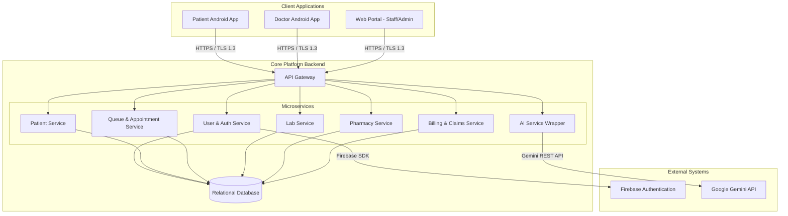

# Software Requirements Specification (SRS)
## Smart Healthcare Intelligence Platform v1.0

---

## 1. Introduction

### Document Purpose and Scope
This document specifies the software requirements for the Smart Healthcare Intelligence Platform (SHIP) v1.0. It defines the functional requirements, non-functional requirements, external interfaces, and platform constraints. This specification binds all client mobile applications (Patient and Doctor apps) and web portals (Operations and Administrative interfaces) to the unified relational database and backend microservices.

### Definitions and Abbreviations
*   **HIS:** Hospital Information System
*   **UHID:** Unique Hospital Identifier
*   **OPD:** Outpatient Department
*   **IPD:** Inpatient Department
*   **PII:** Personally Identifiable Information
*   **PHI:** Protected Health Information
*   **OTP:** One-Time Password
*   **RBAC:** Role-Based Access Control
*   **KMS:** Key Management Service
*   **FLE:** Field-Level Encryption
*   **SOAP:** Subjective, Objective, Assessment, Plan (clinical notes format)
*   **SLA:** Service Level Agreement
*   **CVE:** Common Vulnerabilities and Exposures

### Intended Audience
This document is intended for:
*   Software Engineers (for development and code structuring).
*   Quality Assurance (QA) Engineers (for formulating test plans).
*   Hospital Security Officers (for auditing compliance).
*   Hospital Operations Managers (for validation).

### Version and Date
*   **Version:** 0.1
*   **Date:** 2026-06-15

---

## 2. System Description

### System Context
SHIP acts as the central Hospital Information System (HIS). It connects Patients, Clinicians, and Operations Staff through dedicated interfaces:
*   **Patient Android App:** Authenticates patients, manages appointment bookings, queries live queue statuses, and retrieves lab reports.
*   **Doctor Android App:** Manages patient consultation workflows, retrieves vitals/histories, writes digital prescriptions, and converts dictation audio.
*   **Web Portal:** Provides functional dashboards for Receptionists, Nurses, Lab Staff, Pharmacists, Billing Officers, Administrators, and Super Admins.
*   **External Systems:** Firebase Authentication (for Patient SMS OTP delivery) and the Google Gemini API (for symptom triage, PDF report summaries, and dictation transcription).

### Context Diagram (Mermaid)

### Environmental Assumptions
1.  **Network Bandwidth:** Hospital clinics maintain a stable, active internet connection with a minimum throughput of 10 Mbps.
2.  **User Devices:** Mobile clients run Android 10.0 or higher.
3.  **Firebase API availability:** The Firebase Authentication API is accessible in regions where the patient application is active.
4.  **KMS Availability:** The KMS service is online for real-time field-level encryption/decryption keys.

---

## 3. Functional Requirements

### Module: REG — Registration & Identity

#### FR-REG-01-01: UHID Generation
*   **Statement:** The system SHALL generate a unique, non-modifiable identifier matching the format `UHID-YYYY-XXXXXX` (where YYYY is the current calendar year and XXXXXX is a sequential 6-digit number starting at 000001) upon the submission of a new patient registration form.
*   **Rationale:** Ensures every patient has a single, immutable key across the hospital network.
*   **Source:** F-REG-01
*   **Verification:** Test
*   **Priority:** Must

#### FR-REG-02-01: Profile Field Validation
*   **Statement:** The system SHALL reject the patient registration request and return an input validation error if Name, Date of Birth, Gender, or Address fields are empty or fail string format checks.
*   **Rationale:** Ensures database records are structurally complete and compliant.
*   **Source:** F-REG-02
*   **Verification:** Test
*   **Priority:** Must

---

### Module: OPD — Outpatient Department Management

#### FR-OPD-01-01: Appointment Slot Booking
*   **Statement:** The system SHALL display available doctor consultation timeslots on a 15-minute grid and block slots that are marked as already booked.
*   **Rationale:** Prevents scheduling overlaps in the outpatient clinic.
*   **Source:** F-OPD-01
*   **Verification:** Demonstration
*   **Priority:** Must

#### FR-OPD-02-01: Patient Cancel/Reschedule Window
*   **Statement:** The system SHALL reject any cancellation or rescheduling request submitted by a Patient App client if the request timestamp is less than 2 hours before the scheduled time slot start time.
*   **Rationale:** Enforces clinic rescheduling policy at the service layer.
*   **Source:** F-OPD-02
*   **Verification:** Test
*   **Priority:** Must

#### FR-OPD-03-01: Queue Token Generation
*   **Statement:** The system SHALL generate a sequential queue token number (e.g. T-101) linked to the checked-in patient's UHID and append it to the selected doctor's active waitlist.
*   **Rationale:** Initiates the patient's clinic queue sequence.
*   **Source:** F-OPD-03
*   **Verification:** Test
*   **Priority:** Must

#### FR-OPD-04-01: Queue Polling Rate
*   **Statement:** The Patient App SHALL query active queue status using HTTP polling at a fixed interval of exactly 30 seconds.
*   **Rationale:** Avoids WebSockets connection overhead on the server.
*   **Source:** F-OPD-04
*   **Verification:** Analysis
*   **Priority:** Must

#### FR-OPD-04-02: Wait Time Calculation
*   **Statement:** The system SHALL calculate and display the patient's wait time dynamically using the formula: `Wait Time = (Patients Ahead in Queue) * 15 minutes`.
*   **Rationale:** Provides transparency on clinic delays.
*   **Source:** F-OPD-04
*   **Verification:** Test
*   **Priority:** Must

#### FR-OPD-05-01: Vitals Delivery
*   **Statement:** The system SHALL display the recorded patient vital signs (Blood Pressure, Heart Rate, Temperature, Weight) in the doctor's Consultation Workspace when the doctor opens the patient's active consultation session.
*   **Rationale:** Delivers triage vitals to the consulting physician.
*   **Source:** F-OPD-05
*   **Verification:** Demonstration
*   **Priority:** Must

---

### Module: DOC — Doctor Operating System

#### FR-DOC-01-01: Doctor Dashboard
*   **Statement:** The Doctor Dashboard SHALL display the doctor's scheduled appointments for today, pending lab reports, and scheduled patient follow-ups.
*   **Rationale:** Organizes clinical tasks for the active shift.
*   **Source:** F-DOC-01
*   **Verification:** Demonstration
*   **Priority:** Must

#### FR-DOC-02-01: Historical Records Access
*   **Statement:** The system SHALL display the patient's complete historical consultations and lab reports sorted in reverse chronological order when the doctor opens the Consultation Workspace.
*   **Rationale:** Ensures patient clinical history is accessible during consultation.
*   **Source:** F-DOC-02
*   **Verification:** Demonstration
*   **Priority:** Must

#### FR-DOC-03-01: Digital Prescription Generation
*   **Statement:** The system SHALL prompt the doctor for structured inputs (dosage, duration, instructions) and query the `Medicines` table when writing a digital prescription.
*   **Rationale:** Enforces structured prescribing aligned with the formulary.
*   **Source:** F-DOC-03
*   **Verification:** Test
*   **Priority:** Must

#### FR-DOC-04-01: Progress Notes
*   **Statement:** The system SHALL provide a text field for progress notes and a recovery status dropdown containing the options "Active", "Recovered", and "Referred" in the Treatment progress screen.
*   **Rationale:** Tracks outpatient recovery status.
*   **Source:** F-DOC-04
*   **Verification:** Test
*   **Priority:** Must

---

### Module: IPD — Inpatient Department Management

#### FR-IPD-01-01: Inpatient Bed Allocation
*   **Statement:** The system SHALL allow nurses to create admission records, assign rooms, and allocate beds to patients via the IPD module.
*   **Rationale:** Manages inpatient ward check-in.
*   **Source:** F-IPD-01
*   **Verification:** Test
*   **Priority:** Must

#### FR-IPD-02-01: Ward Map Occupancy
*   **Statement:** The system SHALL update and display bed status in ICU, General Wards, and Private Rooms in real-time, using color-coded indicators for bed availability.
*   **Rationale:** Provides nurses with structural bed occupancy tracking.
*   **Source:** F-IPD-02
*   **Verification:** Demonstration
*   **Priority:** Must

#### FR-IPD-03-01: Discharge Invoicing
*   **Statement:** The system SHALL update the bed status to "Cleaning/Maintenance" and trigger billing invoice generation when the nurse marks an admission record as discharged.
*   **Rationale:** Automates the discharge sequence and triggers invoicing.
*   **Source:** F-IPD-03
*   **Verification:** Test
*   **Priority:** Must

---

### Module: LAB — Laboratory Management

#### FR-LAB-01-01: Lab Order Generation
*   **Statement:** The system SHALL write a lab order to the `Reports` table with status "Requested" when a doctor submits a diagnostic test request during consultation.
*   **Rationale:** Routes diagnostic requests from clinics to the lab.
*   **Source:** F-LAB-01
*   **Verification:** Test
*   **Priority:** Must

#### FR-LAB-02-01: Lab Workflow Transitions
*   **Statement:** The system SHALL allow lab staff to transition order status sequentially through "Requested", "Sample Collected", "Processing", "Completed", and "Uploaded".
*   **Rationale:** Monitors the diagnostic sample lifecycle.
*   **Source:** F-LAB-02
*   **Verification:** Test
*   **Priority:** Must

#### FR-LAB-03-01: PDF Report Upload
*   **Statement:** The system SHALL accept PDF uploads up to 10MB, write the report URL to the `Reports` table, and set the status to "Uploaded" when lab staff finalize a test.
*   **Rationale:** Archives reports permanently in the patient database.
*   **Source:** F-LAB-03
*   **Verification:** Test
*   **Priority:** Must

#### FR-LAB-04-01: Report Retrieval
*   **Statement:** The Patient App SHALL display a list of uploaded reports and provide a download/view action for report PDFs belonging to the patient's authenticated UHID.
*   **Rationale:** Delivers lab results directly to patients.
*   **Source:** F-LAB-04
*   **Verification:** Demonstration
*   **Priority:** Must

---

### Module: PHR — Pharmacy Management

#### FR-PHR-01-01: Prescription Fulfillment
*   **Statement:** The Pharmacist Portal SHALL display a search-and-view interface for active doctor prescriptions and allow marking them as "Dispensed".
*   **Rationale:** Fulfills e-prescriptions digitally in the pharmacy.
*   **Source:** F-PHR-01
*   **Verification:** Demonstration
*   **Priority:** Must

#### FR-PHR-02-01: Stock Tracking
*   **Statement:** The system SHALL display medicine stock counts, alert on near-expiry batches, and allow pharmacists to execute manual stock adjustments with mandatory textual reason log.
*   **Rationale:** Maintains pharmacy stock control and safety.
*   **Source:** F-PHR-02
*   **Verification:** Test
*   **Priority:** Must

---

### Module: BIL — Billing & Insurance

#### FR-BIL-01-01: Invoice Generation
*   **Statement:** The Billing Engine SHALL compile outstanding charges (consultation, lab, room) linked to a patient's UHID and generate an itemized invoice.
*   **Rationale:** Computes patient charges to prevent revenue leakage.
*   **Source:** F-BIL-01
*   **Verification:** Test
*   **Priority:** Must

#### FR-BIL-02-01: Insurance Claim Status
*   **Statement:** The system SHALL capture Policy Number, Insurance Provider, Claim Amount, and Claim Details and track status through "Pending", "Approved", and "Rejected" for manual claims.
*   **Rationale:** Logs manual insurance details.
*   **Source:** F-BIL-02
*   **Verification:** Test
*   **Priority:** Must

---

### Module: AI — AI Layer

#### FR-AI-01-01: Symptom Triage Chat
*   **Statement:** The AI Symptom Assistant SHALL parse patient-entered symptoms using the Google Gemini API, output an urgency tier (Low, Medium, High) with specialist recommendation, and prepend a diagnostic disclaimer.
*   **Rationale:** Automates patient symptom triage safely.
*   **Source:** F-AI-01
*   **Verification:** Test
*   **Priority:** Should

#### FR-AI-02-01: PDF Report Explainer
*   **Statement:** The AI Lab Report Explainer SHALL send extracted text from report PDFs to the Google Gemini API and render a patient-friendly summary.
*   **Rationale:** Explains medical metrics in simple terms.
*   **Source:** F-AI-02
*   **Verification:** Test
*   **Priority:** Should

#### FR-AI-03-01: Voice Dictation Scribe
*   **Statement:** The AI Medical Scribe SHALL upload doctor voice dictations, transcribe the audio using Google Gemini, and structure the text into SOAP format for doctor review and edit.
*   **Rationale:** Reduces doctor clinical documentation overhead.
*   **Source:** F-AI-03
*   **Verification:** Test
*   **Priority:** Should

#### FR-AI-04-01: Clinical Risk Flags
*   **Statement:** The system SHALL scan patient histories and highlight flags for readmission risk (discharge < 30 days), critical lab values, and chronic conditions.
*   **Rationale:** Flags high-risk conditions automatically for safer care.
*   **Source:** F-AI-04
*   **Verification:** Test
*   **Priority:** Should

---

### Module: ANA — Analytics & Intelligence

#### FR-ANA-01-01: Executive Dashboard
*   **Statement:** The Executive Dashboard SHALL display real-time aggregate charts showing total revenue, bed occupancy rate, average wait time, and patient volume.
*   **Rationale:** Provides hospital operational oversight.
*   **Source:** F-ANA-01
*   **Verification:** Demonstration
*   **Priority:** Must

#### FR-ANA-02-01: Doctor Utilization
*   **Statement:** The system SHALL compile and display consultation volumes and doctor utilization rates based on active shift schedules.
*   **Rationale:** Monitors doctor scheduling efficiency.
*   **Source:** F-ANA-02
*   **Verification:** Analysis
*   **Priority:** Should

#### FR-ANA-03-01: Forecasting Curves
*   **Statement:** The system SHALL compute and display 7-day predictive curves and confidence intervals for bed occupancy, staffing, and inventory.
*   **Rationale:** Helps administrators forecast hospital resource demands.
*   **Source:** F-ANA-03
*   **Verification:** Analysis
*   **Priority:** Should

---

### Module: SEC — Security & Compliance

#### FR-SEC-01-01: Patient Authentication
*   **Statement:** The system SHALL authenticate Patient mobile clients using SMS OTP verification via Firebase Authentication.
*   **Rationale:** Secures patient access via mobile device binding.
*   **Source:** F-SEC-01
*   **Verification:** Test
*   **Priority:** Must

#### FR-SEC-02-01: Staff Auth and RBAC
*   **Statement:** The system SHALL authenticate staff accounts using email and password, enforce HTTP-only SameSite cookies, and validate RBAC permissions on every request.
*   **Rationale:** Secures access to internal clinical interfaces.
*   **Source:** F-SEC-02
*   **Verification:** Test
*   **Priority:** Must

#### FR-SEC-03-01: HIPAA Audit Trail
*   **Statement:** The system SHALL automatically log all reads and writes on Patient data in the `AuditLogs` table, capturing pre- and post-modification states for modifications.
*   **Rationale:** Tracks medical data changes for compliance.
*   **Source:** F-SEC-03
*   **Verification:** Test
*   **Priority:** Must

#### FR-SEC-04-01: Data Deletion Lock
*   **Statement:** The system SHALL reject any delete or modify requests targeting finalized prescriptions, clinical notes, and lab reports.
*   **Rationale:** Enforces clinical data retention compliance.
*   **Source:** F-SEC-04
*   **Verification:** Test
*   **Priority:** Must

---

### Module: ADM — System Administration

#### FR-ADM-01-01: Hospital Staff Configuration
*   **Statement:** The system SHALL allow Administrators to create staff accounts, assign roles, associate them with departments, and configure department settings.
*   **Rationale:** Manages staff configurations within the hospital.
*   **Source:** F-ADM-01
*   **Verification:** Test
*   **Priority:** Must

#### FR-ADM-02-01: Platform System Settings
*   **Statement:** The platform management portal SHALL allow Super Admins to configure platform-wide system variables, roles, and global parameters.
*   **Rationale:** Enables platform setting configurations.
*   **Source:** F-ADM-02
*   **Verification:** Test
*   **Priority:** Must

---

## 4. Non-Functional Requirements

### Category: Performance

#### NFR-PERF-01: Web Portal Page Load Speed
*   **Statement:** The Web Portal pages SHALL load and display all UI elements in less than 2.0 seconds under network connection speeds of 10 Mbps or higher.
*   **Rationale:** Meets the performance SLA defined in the PRD.
*   **Source:** PRD Section 5
*   **Verification:** Test
*   **Priority:** Must

#### NFR-PERF-02: Mobile API Latency
*   **Statement:** The system API endpoints SHALL respond to mobile client requests in less than 500 milliseconds.
*   **Rationale:** Ensures responsive mobile user interaction.
*   **Source:** PRD Section 5
*   **Verification:** Test
*   **Priority:** Must

#### NFR-PERF-03: Analytics Compile Speed
*   **Statement:** The analytics engine SHALL compile and display charts for up to 10,000 historical database records in less than 3.0 seconds.
*   **Rationale:** Prevents UI blocking during heavy operations reporting.
*   **Source:** PRD Section 5
*   **Verification:** Test
*   **Priority:** Must

#### NFR-PERF-04: Scribe Transcription Speed
*   **Statement:** The AI Scribe processing wrapper SHALL return structured SOAP text in less than 15.0 seconds for uploaded audio files of up to 2 minutes in duration.
*   **Rationale:** Maximizes doctor workspace efficiency.
*   **Source:** PRD Section 5
*   **Verification:** Test
*   **Priority:** Should

### Category: Security

#### NFR-SEC-01: Encryption at Rest
*   **Statement:** The database management system SHALL encrypt all persistent data files at rest using AES-256 encryption.
*   **Rationale:** Complies with storage-level HIPAA security standards.
*   **Source:** PRD Section 5 / Security Req Sec 4
*   **Verification:** Inspection
*   **Priority:** Must

#### NFR-SEC-02: Encryption in Transit
*   **Statement:** All client-to-server API network communications SHALL be encrypted using TLS 1.3 over HTTPS.
*   **Rationale:** Prevents eavesdropping and interception of PHI.
*   **Source:** PRD Section 5 / Security Req Sec 4
*   **Verification:** Inspection
*   **Priority:** Must

#### NFR-SEC-03: Web Portal Idle Session Timeout
*   **Statement:** The web application portal SHALL invalidate user session identifiers and clear client cookies after exactly 15 minutes of user inactivity.
*   **Rationale:** Restricts unauthorized access on shared terminal devices.
*   **Source:** PRD Section 5 / Security Req Sec 2
*   **Verification:** Test
*   **Priority:** Must

#### NFR-SEC-04: Password Hashing
*   **Statement:** The system database SHALL store all staff user credentials using the bcrypt algorithm with a work factor of 10.
*   **Rationale:** Protects credentials from brute force or leak attacks.
*   **Source:** PRD Section 5 / Security Req Sec 2
*   **Verification:** Inspection
*   **Priority:** Must

#### NFR-SEC-05: Pre- and Post-State Logging
*   **Statement:** The audit logging engine SHALL capture and save the complete pre- and post-modification states of modified patient records in the `AuditLogs` table.
*   **Rationale:** Enables forensic tracing of clinical record changes.
*   **Source:** PRD Section 5 / Security Req Sec 8
*   **Verification:** Test
*   **Priority:** Must

### Category: Reliability

#### NFR-RELI-01: Platform System Uptime
*   **Statement:** The platform backend services SHALL maintain an uptime availability of 99.9% (excluding planned maintenance windows).
*   **Rationale:** Ensures round-the-clock clinical service delivery.
*   **Source:** PRD Section 5
*   **Verification:** Analysis
*   **Priority:** Must

#### NFR-RELI-02: API Server Error Rate
*   **Statement:** The API server error rate SHALL remain below 0.1% under concurrent loads of up to 100 requests.
*   **Rationale:** Ensures system stability during peak clinic hours.
*   **Source:** PRD Section 5
*   **Verification:** Test
*   **Priority:** Must

### Category: Usability

#### NFR-USAB-01: Network Offline Banner
*   **Statement:** The Patient and Doctor mobile applications SHALL display a clear offline warning banner and disable write forms upon detection of network connectivity loss, without crashing or terminating the application.
*   **Rationale:** Handles transient network drops in concrete structures gracefully.
*   **Source:** PRD Section 5 / Security Req Sec 8
*   **Verification:** Demonstration
*   **Priority:** Must

---

## 5. External Interface Requirements

### User Interfaces
*   **Patient App (OPD Home):** Screen displaying upcoming appointments, a "My Reports" tab, and the symptom assistant chat bubble.
*   **Patient App (Queue Status):** Dynamic waiting view displaying active token number, patients ahead, and estimated wait times.
*   **Doctor App (Dashboard):** Workspace displaying a list of current appointments, checked-in tokens, and shortcuts to consultation screens.
*   **Doctor App (Consultation Workspace):** Split screen displaying patient medical history/reports on the left and clinical note inputs/prescription writers on the right.
*   **Web Portal (Reception/Billing):** Data forms for patient intake, scheduling grids, invoice builders, and manual claims logs.
*   **Web Portal (Lab/Pharmacy/Admin):** Lab order queues, PDF report upload dropzones, inventory adjustment dashboards, and settings dashboards.

### Hardware Interfaces
*   **Doctor Device Microphone:** The Doctor Android App interfaces with the device microphone hardware to capture consultation voice dictation.
*   **Patient Device Display:** General touch screen interactions for scheduling.

### Software Interfaces
*   **Firebase Authentication REST API:** Used to trigger, route, and verify SMS OTP tokens for patient mobile logins.
*   **Google Gemini REST API Wrapper:** Core API interface used to parse symptom triage text, read and summarize PDF reports, and transcribe/format dictation audio files into SOAP formats.

### Communication Interfaces
*   **Network Protocols:** HTTPS over TCP/IP.
*   **Cryptographic Protocols:** TLS 1.3 minimum.
*   **Listening Ports:** Port 443 (for all secure API routing).
*   **Data Serialization Formats:** Application/JSON for standard API requests/responses; multipart/form-data for PDF report uploads and audio recording file transmittals.

---

## 6. Constraints

### Regulatory Constraints
1.  **HIPAA Compliance:** The system MUST encrypt PHI data (FLE for restricted fields), execute full data access logging (AuditLogs), manage explicit patient consent records, and lock finalized clinical records against deletion.
2.  **Local Data Protection Regulation:** The system MUST support cryptographic shredding (deleting patient-specific encryption keys from KMS) when legal deletion mandates override medical data retention limits.

### Hardware Constraints
1.  **Mobile Client Memory:** Android devices running Patient and Doctor applications MUST possess a minimum of 3GB RAM and run Android 10.0 or higher.
2.  **Microphone Access:** Doctor devices MUST have a functional recording hardware capability with Android microphone permission granted to the app.

### Technology Constraints
1.  **Online-Only Architecture:** The mobile clients are online-only and require active network connections for data read/write. Local caching is limited strictly to UI layout rendering and basic offline banners.
2.  **Relational Database Engine:** The system backend MUST use a relational SQL database engine to enforce schema validations and relational constraints.

---

## 7. Traceability Matrix

| Business Need (Blueprint Section) | PRD Feature ID | SRS Requirement ID(s) | Verification Method |
| :--- | :--- | :--- | :--- |
| Patient registration (UHID creation) | F-REG-01 | FR-REG-01-01 | Test |
| Patient profile capture | F-REG-02 | FR-REG-02-01 | Test |
| Appointment scheduling | F-OPD-01 | FR-OPD-01-01 | Demonstration |
| Patient booking app | F-OPD-02 | FR-OPD-02-01 | Test |
| Queue token generation | F-OPD-03 | FR-OPD-03-01 | Test |
| Wait time polling | F-OPD-04 | FR-OPD-04-01, FR-OPD-04-02 | Analysis / Test |
| OPD nurse triage | F-OPD-05 | FR-OPD-05-01 | Demonstration |
| Doctor dashboard | F-DOC-01 | FR-DOC-01-01 | Demonstration |
| Consultation workspace | F-DOC-02 | FR-DOC-02-01 | Demonstration |
| Digital prescriptions | F-DOC-03 | FR-DOC-03-01 | Test |
| Progress notes & recovery dropdown | F-DOC-04 | FR-DOC-04-01 | Test |
| Admission management | F-IPD-01 | FR-IPD-01-01 | Test |
| Ward bed allocation | F-IPD-02 | FR-IPD-02-01 | Demonstration |
| Discharge billing trigger | F-IPD-03 | FR-IPD-03-01 | Test |
| Lab requests | F-LAB-01 | FR-LAB-01-01 | Test |
| Lab processing workflow | F-LAB-02 | FR-LAB-02-01 | Test |
| PDF report archive | F-LAB-03 | FR-LAB-03-01 | Test |
| Patient report download | F-LAB-04 | FR-LAB-04-01 | Demonstration |
| Prescription fulfillment | F-PHR-01 | FR-PHR-01-01 | Demonstration |
| Standalone inventory | F-PHR-02 | FR-PHR-02-01 | Test |
| Itemized invoicing | F-BIL-01 | FR-BIL-01-01 | Test |
| Manual insurance claims | F-BIL-02 | FR-BIL-02-01 | Test |
| AI symptom assistant chat | F-AI-01 | FR-AI-01-01 | Test |
| AI report explainer | F-AI-02 | FR-AI-02-01 | Test |
| AI voice scribe SOAP notes | F-AI-03 | FR-AI-03-01 | Test |
| AI risk flags | F-AI-04 | FR-AI-04-01 | Test |
| Executive analytics dashboard | F-ANA-01 | FR-ANA-01-01 | Demonstration |
| Doctor utilization | F-ANA-02 | FR-ANA-02-01 | Analysis |
| Bed/staffing forecasts | F-ANA-03 | FR-ANA-03-01 | Analysis |
| SMS OTP Firebase auth | F-SEC-01 | FR-SEC-01-01 | Test |
| Staff auth and RBAC | F-SEC-02 | FR-SEC-02-01 | Test |
| HIPAA audit trail | F-SEC-03 | FR-SEC-03-01 | Test |
| Consent log & delete lock | F-SEC-04 | FR-SEC-04-01 | Test |
| Hospital-wide settings | F-ADM-01 | FR-ADM-01-01 | Test |
| Platform configuration | F-ADM-02 | FR-ADM-02-01 | Test |
| Web page load speed | PRD Sec 5 NFR | NFR-PERF-01 | Test |
| Mobile API latency | PRD Sec 5 NFR | NFR-PERF-02 | Test |
| Dashboard load speed | PRD Sec 5 NFR | NFR-PERF-03 | Test |
| Voice scribe duration | PRD Sec 5 NFR | NFR-PERF-04 | Test |
| AES-256 rest encryption | PRD Sec 5 NFR | NFR-SEC-01 | Inspection |
| TLS 1.3 transit encryption | PRD Sec 5 NFR | NFR-SEC-02 | Inspection |
| 15m idle session timeout | PRD Sec 5 NFR | NFR-SEC-03 | Test |
| Bcrypt password storage | PRD Sec 5 NFR | NFR-SEC-04 | Inspection |
| Audit logs state capture | PRD Sec 5 NFR | NFR-SEC-05 | Test |
| 99.9% uptime standard | PRD Sec 5 NFR | NFR-RELI-01 | Analysis |
| 0.1% error rate threshold | PRD Sec 5 NFR | NFR-RELI-02 | Test |
| Local offline UI banner | PRD Sec 5 NFR | NFR-USAB-01 | Demonstration |
