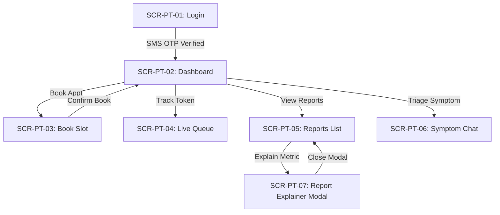

# User Interface Screens Document
## Smart Healthcare Intelligence Platform v1.0

Orphan check complete: No orphaned endpoints found. All 38 API routes map directly to user interface screens. Every role defined in Blueprint.md has a distinct entry-point dashboard screen.

---

## 1. Patient App Screens

### SCR-PT-01 — Patient Login (Firebase OTP)
*   **Role:** Patient
*   **Purpose:** Allows patients to log in securely using Firebase SMS OTP verification.
*   **Route Reference:** `/login` (to be filled by Routes.md)
*   **Entry Points:** None (Initial app launch screen)
*   **Content Inventory:**
    | Element | Data Source | API Endpoint | Notes |
    | :--- | :--- | :--- | :--- |
    | Phone Input Field | User Input | None | Enforces local phone format constraints. |
    | OTP Input Code Field | User Input | None | Displayed after SMS OTP is sent. |
    | "Send OTP" Button | User Action | None | Calls Firebase Authentication SDK. |
    | "Login" Button | User Action | `POST /v1/auth/patients/login` | Dispatches Firebase token to server. |
*   **Available Actions:**
    | Action | Trigger | Result | API Call |
    | :--- | :--- | :--- | :--- |
    | Send OTP Code | Click "Send OTP" | Firebase dispatches SMS verification code. | Firebase SDK Client Call |
    | Authenticate Code | Click "Login" | Session starts; redirects to Patient Dashboard. | `POST /v1/auth/patients/login` |
*   **State Variations:**
    | State | Behaviour |
    | :--- | :--- |
    | **Loading** | Disables all buttons; displays circular loading indicator during SMS delivery and login processing. |
    | **Empty** | Not applicable. |
    | **Error** | Shows warning text: "Invalid OTP code. Please request a new code." |
    | **Role Variant**| None. |
*   **Exit Points:** `SCR-PT-02` (Patient Home Dashboard)

---

### SCR-PT-02 — Patient Home Dashboard
*   **Role:** Patient
*   **Purpose:** Serves as the patient's landing page, displaying appointments and quick links.
*   **Route Reference:** `/dashboard` (to be filled by Routes.md)
*   **Entry Points:** `SCR-PT-01` (Patient Login)
*   **Content Inventory:**
    | Element | Data Source | API Endpoint | Notes |
    | :--- | :--- | :--- | :--- |
    | Upcoming Appointment Banner | Backend | `GET /v1/appointments` | Displays date, time, and doctor. |
    | Quick Action Shortcuts | Static Layout | None | Navigation buttons to triage, bookings, reports. |
*   **Available Actions:**
    | Action | Trigger | Result | API Call |
    | :--- | :--- | :--- | :--- |
    | View Appointments | Click Shortcut | Navigates to appointments list view. | `GET /v1/appointments` |
    | Start Triage Chat | Click Shortcut | Navigates to Symptom Chat screen. | None |
*   **State Variations:**
    | State | Behaviour |
    | :--- | :--- |
    | **Loading** | Shows shimmering card placeholders for the upcoming appointment banner. |
    | **Empty** | Displays text: "No upcoming appointments scheduled. Click below to book." |
    | **Error** | Shows toast: "Failed to load dashboard. Pull down to refresh." |
    | **Role Variant**| None. |
*   **Exit Points:** `SCR-PT-03` (Book Appointment), `SCR-PT-04` (Live Queue), `SCR-PT-05` (Reports), `SCR-PT-06` (Symptom Chat)

---

### SCR-PT-03 — Book Appointment
*   **Role:** Patient
*   **Purpose:** Enables patients to select a doctor and reserve a 15-minute OPD appointment slot.
*   **Route Reference:** `/appointments/book` (to be filled by Routes.md)
*   **Entry Points:** `SCR-PT-02` (Home Dashboard)
*   **Content Inventory:**
    | Element | Data Source | API Endpoint | Notes |
    | :--- | :--- | :--- | :--- |
    | Doctor Dropdown List | Backend | `GET /v1/medicines` (using doctor list metadata)| Fetches rostered doctors. |
    | Calendar Date Picker | Static UI | None | Patient selects appointment date. |
    | Time Slot Grid | Backend | `GET /v1/appointments` | Shows 15-minute grid slots (Available/Booked). |
*   **Available Actions:**
    | Action | Trigger | Result | API Call |
    | :--- | :--- | :--- | :--- |
    | Filter Slots | Select Date | Queries and displays available timeslots. | `GET /v1/appointments` |
    | Confirm Booking | Click "Book Slot" | Displays booking confirmation dialog. | `POST /v1/appointments` |
*   **State Variations:**
    | State | Behaviour |
    | :--- | :--- |
    | **Loading** | Displays progress spinners inside the slot grid container. |
    | **Empty** | Shows text: "No slots available for the selected doctor on this date." |
    | **Error** | Shows dialog: "Booking slot conflict. This slot was reserved by another patient. Reloading." |
    | **Role Variant**| None. |
*   **Exit Points:** `SCR-PT-02` (Home Dashboard)

---

### SCR-PT-04 — Live Queue Tracking
*   **Role:** Patient
*   **Purpose:** Allows patients to view their queue tokens and estimated waiting times.
*   **Route Reference:** `/queue` (to be filled by Routes.md)
*   **Entry Points:** `SCR-PT-02` (Home Dashboard)
*   **Content Inventory:**
    | Element | Data Source | API Endpoint | Notes |
    | :--- | :--- | :--- | :--- |
    | Token Number Card | Backend | `GET /v1/queues/tokens/active` | Displays Patient's token (e.g. T-101). |
    | Patients Ahead Count | Backend | `GET /v1/queues/tokens/active` | Number of patients ahead in waitlist. |
    | Estimated Wait Time | Backend | `GET /v1/queues/tokens/active` | Calculated dynamically (`Ahead * 15m`). |
*   **Available Actions:**
    | Action | Trigger | Result | API Call |
    | :--- | :--- | :--- | :--- |
    | Refresh Queue | Manual Pull | Updates active queue counters. | `GET /v1/queues/tokens/active` |
*   **State Variations:**
    | State | Behaviour |
    | :--- | :--- |
    | **Loading** | Displays animated pulse animation on the token card. |
    | **Empty** | Shows text: "No active queue tokens. You must check-in at reception." |
    | **Error** | Shows offline warning header: "Connection lost. Displaying last cached wait time." |
    | **Role Variant**| None. |
*   **Exit Points:** `SCR-PT-02` (Home Dashboard)

---

### SCR-PT-05 — Lab Reports List
*   **Role:** Patient
*   **Purpose:** Displays patient's diagnostic lab reports and generates pre-signed download URLs.
*   **Route Reference:** `/reports` (to be filled by Routes.md)
*   **Entry Points:** `SCR-PT-02` (Home Dashboard)
*   **Content Inventory:**
    | Element | Data Source | API Endpoint | Notes |
    | :--- | :--- | :--- | :--- |
    | Reports List | Backend | `GET /v1/lab/reports` | Shows report name, upload date, and file links. |
*   **Available Actions:**
    | Action | Trigger | Result | API Call |
    | :--- | :--- | :--- | :--- |
    | Download Report PDF| Click "Download" | Opens secure PDF file in device browser or viewer. | `GET /v1/lab/reports` (resolves signed URL) |
    | Explain Report | Click "Explain" | Opens AI Lab Report Explainer Modal. | `POST /v1/ai/lab-reports/{id}/explain` |
*   **State Variations:**
    | State | Behaviour |
    | :--- | :--- |
    | **Loading** | Displays list item progress bars. |
    | **Empty** | Shows text: "No diagnostic lab reports available on your record." |
    | **Error** | Shows toast: "Failed to fetch reports. Please verify network connection." |
    | **Role Variant**| None. |
*   **Exit Points:** `SCR-PT-07` (AI Report Explainer Modal)

---

### SCR-PT-06 — AI Symptom Chatbot
*   **Role:** Patient
*   **Purpose:** Triage assistant chatbot allowing patients to check symptoms and get recommendations.
*   **Route Reference:** `/triage` (to be filled by Routes.md)
*   **Entry Points:** `SCR-PT-02` (Home Dashboard)
*   **Content Inventory:**
    | Element | Data Source | API Endpoint | Notes |
    | :--- | :--- | :--- | :--- |
    | Chat Messages Log | Local state / DB | `POST /v1/ai/symptoms/triage` | Shows prompt disclaimer and message balloons. |
    | Input Text Field | User Input | None | Patient types symptom descriptions. |
*   **Available Actions:**
    | Action | Trigger | Result | API Call |
    | :--- | :--- | :--- | :--- |
    | Send Message | Click Send | Dispatches chat text; displays triage recommendation. | `POST /v1/ai/symptoms/triage` |
*   **State Variations:**
    | State | Behaviour |
    | :--- | :--- |
    | **Loading** | Displays typing dots indicator while Gemini resolves triage recommendations. |
    | **Empty** | Displays initial triage warning modal and starting disclaimer. |
    | **Error** | Shows text: "AI Assistant unavailable. For emergencies, consult immediate care." |
    | **Role Variant**| None. |
*   **Exit Points:** `SCR-PT-02` (Home Dashboard)

---

### SCR-PT-07 — AI Lab Report Explainer Modal
*   **Role:** Patient
*   **Purpose:** Renders patient-friendly explanations of PDF report files.
*   **Route Reference:** Modal (Overlay on `SCR-PT-05`)
*   **Entry Points:** `SCR-PT-05` (Lab Reports List)
*   **Content Inventory:**
    | Element | Data Source | API Endpoint | Notes |
    | :--- | :--- | :--- | :--- |
    | AI Summary Text | Backend | `POST /v1/ai/lab-reports/{id}/explain` | Shows simplified analysis text blocks. |
*   **Available Actions:**
    | Action | Trigger | Result | API Call |
    | :--- | :--- | :--- | :--- |
    | Close Explainer | Click Close | Dismisses modal overlay. | None |
*   **State Variations:**
    | State | Behaviour |
    | :--- | :--- |
    | **Loading** | Displays progress spinners inside the modal overlay. |
    | **Empty** | Not applicable. |
    | **Error** | Shows text: "AI Explainer timed out. Please review with your doctor." |
    | **Role Variant**| None. |
*   **Exit Points:** Dismiss overlay (returns to `SCR-PT-05`)

---

## 2. Doctor App Screens

### SCR-DR-01 — Staff Login Portal
*   **Role:** All Staff roles (Doctors, Nurses, Receptionists, Lab, Pharmacists, Billing, Admins)
*   **Purpose:** Secure gateway authentication for all internal hospital staff.
*   **Route Reference:** `/staff/login` (to be filled by Routes.md)
*   **Entry Points:** None (Initial portal launch screen)
*   **Content Inventory:**
    | Element | Data Source | API Endpoint | Notes |
    | :--- | :--- | :--- | :--- |
    | Email Input | User Input | None | Text email field. |
    | Password Input | User Input | None | Password mask entry. |
    | "Sign In" Button | User Action | `POST /v1/auth/staff/login` | Submits auth payloads. |
*   **Available Actions:**
    | Action | Trigger | Result | API Call |
    | :--- | :--- | :--- | :--- |
    | Authenticate Staff | Click "Sign In" | Session cookie is saved; routes user based on RBAC role. | `POST /v1/auth/staff/login` |
*   **State Variations:**
    | State | Behaviour |
    | :--- | :--- |
    | **Loading** | Displays progress overlays; blocks input elements. |
    | **Empty** | Not applicable. |
    | **Error** | Shows warning banner: "Invalid email/password combinations. 3 attempts remaining before lockout." |
    | **Role Variant**| Web Portal redirects to respective operational dashboards. Android app redirects to `SCR-DR-02`. |
*   **Exit Points:** `SCR-DR-02` (Doctor Schedule), `SCR-RC-01` (Reception), `SCR-NS-01` (Nurse Dashboard), `SCR-LS-01` (Lab Dashboard), `SCR-PH-01` (Pharmacy Dashboard), `SCR-BO-01` (Billing Dashboard), `SCR-AD-01` (Admin Dashboard)

---

### SCR-DR-02 — Doctor Schedule Dashboard
*   **Role:** Doctor
*   **Purpose:** Doctor schedule dashboard displaying daily waitlists and consultation queues.
*   **Route Reference:** `/doctor/dashboard` (to be filled by Routes.md)
*   **Entry Points:** `SCR-DR-01` (Staff Login Portal)
*   **Content Inventory:**
    | Element | Data Source | API Endpoint | Notes |
    | :--- | :--- | :--- | :--- |
    | Patient Queue List | Backend | `GET /v1/queues/tokens/active` | Chronological list of checked-in patient tokens today. |
    | Pending Reports | Backend | `GET /v1/lab/reports` | Alerts for newly uploaded lab reports. |
*   **Available Actions:**
    | Action | Trigger | Result | API Call |
    | :--- | :--- | :--- | :--- |
    | Call Patient Token | Click "Call" | Changes token status to In-Consultation; opens Consultation Workspace. | `PUT /v1/queues/tokens/{id}/status` |
    | View Report Alert | Click Alert | Opens Patient report in detail overlay. | `GET /v1/lab/reports` |
*   **State Variations:**
    | State | Behaviour |
    | :--- | :--- |
    | **Loading** | Shimmer rows displayed. |
    | **Empty** | Displays text: "All consultation sessions completed. No waiting patients." |
    | **Error** | Shows dialog: "Roster connection offline. Reloading schedule queue." |
    | **Role Variant**| None. |
*   **Exit Points:** `SCR-DR-03` (Patient Search), `SCR-DR-04` (Consultation Workspace)

---

### SCR-DR-03 — Patient Medical Search
*   **Role:** Doctor
*   **Purpose:** Allows doctors to search the patient directory by name or UHID.
*   **Route Reference:** `/doctor/patients` (to be filled by Routes.md)
*   **Entry Points:** `SCR-DR-02` (Doctor Schedule Dashboard)
*   **Content Inventory:**
    | Element | Data Source | API Endpoint | Notes |
    | :--- | :--- | :--- | :--- |
    | Search Input Field | User Input | None | Searches for name/UHID string. |
    | Patient Directory List| Backend | `GET /v1/patients/{id}` (queries patient lists) | Shows matching patient IDs and genders. |
*   **Available Actions:**
    | Action | Trigger | Result | API Call |
    | :--- | :--- | :--- | :--- |
    | Execute Search | Type 3+ chars | Queries directory database. | `GET /v1/patients/{id}` |
    | Select Patient | Click Item | Navigates to Patient Profile and histories. | `GET /v1/patients/{id}` |
*   **State Variations:**
    | State | Behaviour |
    | :--- | :--- |
    | **Loading** | Displays list spinner. |
    | **Empty** | Shows text: "No patient matching this UHID/name found." |
    | **Error** | Shows toast: "Failed to search patient directory." |
    | **Role Variant**| None. |
*   **Exit Points:** `SCR-DR-02` (Dashboard)

---

### SCR-DR-04 — Consultation Workspace
*   **Role:** Doctor
*   **Purpose:** Core consulting screen for writing notes, entering diagnoses, and launching tools.
*   **Route Reference:** `/doctor/consultation/{id}` (to be filled by Routes.md)
*   **Entry Points:** `SCR-DR-02` (Dashboard)
*   **Content Inventory:**
    | Element | Data Source | API Endpoint | Notes |
    | :--- | :--- | :--- | :--- |
    | Patient Vitals Box | Backend | `GET /v1/patients/{id}` (fetches vitals via consultation) | Shows BP, HR, Temp, Weight. |
    | Notes Form Input | User Input | None | Text area for clinical observations. |
    | Diagnosis Input Field | User Input | None | Diagnostic name text field. |
    | Recovery Status Menu | User Input | None | Dropdown containing recovery enum values. |
*   **Available Actions:**
    | Action | Trigger | Result | API Call |
    | :--- | :--- | :--- | :--- |
    | Launch Scribe | Click "AI Scribe" | Opens AI Scribe Dictation modal. | None |
    | Write Prescription | Click "Prescribe"| Navigates to Prescription Writer form. | None |
    | Finalize Consultation| Click "Save Consult" | Saves notes, set token status to Completed, returns to schedule. | `POST /v1/consultations` |
*   **State Variations:**
    | State | Behaviour |
    | :--- | :--- |
    | **Loading** | Displays progress spinners inside notes panel. |
    | **Empty** | Not applicable. |
    | **Error** | Shows text: "Failed to save consultation. Vitals record offline." |
    | **Role Variant**| None. |
*   **Exit Points:** `SCR-DR-05` (Prescription Writer), `SCR-DR-06` (AI Scribe Modal), `SCR-DR-07` (Risk Flags View)

---

### SCR-DR-05 — Prescription Writer Form
*   **Role:** Doctor
*   **Purpose:** Allows doctors to formulate drug instructions matching the formulary.
*   **Route Reference:** `/doctor/consultation/{id}/prescribe` (to be filled by Routes.md)
*   **Entry Points:** `SCR-DR-04` (Consultation Workspace)
*   **Content Inventory:**
    | Element | Data Source | API Endpoint | Notes |
    | :--- | :--- | :--- | :--- |
    | Drug Search Autocomplete| Backend | `GET /v1/medicines` | Queries formulary medicines. |
    | Dosage Structured Input | User Input | None | Fields for quantity, units, intervals. |
    | Duration Input | User Input | None | Fields for duration (e.g. days/weeks). |
    | Instructions Area | User Input | None | Free-text instructions. |
*   **Available Actions:**
    | Action | Trigger | Result | API Call |
    | :--- | :--- | :--- | :--- |
    | Search Formulary | Type 2+ chars | Displays list of matching drugs. | `GET /v1/medicines` |
    | Save Prescription | Click "Save" | Validates, submits items, returns to Consultation Workspace. | `POST /v1/prescriptions` |
*   **State Variations:**
    | State | Behaviour |
    | :--- | :--- |
    | **Loading** | Displays dropdown autocomplete loaders. |
    | **Empty** | Shows text: "No drugs matching search term in standard formulary." |
    | **Error** | Shows toast: "Failed to save prescription items." |
    | **Role Variant**| None. |
*   **Exit Points:** `SCR-DR-04` (Consultation Workspace)

---

### SCR-DR-06 — AI Scribe Dictation Modal
*   **Role:** Doctor
*   **Purpose:** Records dictations, parses transcripts, and copies SOAP notes.
*   **Route Reference:** Modal (Overlay on `SCR-DR-04`)
*   **Entry Points:** `SCR-DR-04` (Consultation Workspace)
*   **Content Inventory:**
    | Element | Data Source | API Endpoint | Notes |
    | :--- | :--- | :--- | :--- |
    | Audio Record Controls | User Action | None | Record, Pause, Stop buttons. |
    | Output SOAP notes | Backend | `POST /v1/ai/scribe/sessions/{id}/transcribe` | Shows generated SOAP markdown draft. |
*   **Available Actions:**
    | Action | Trigger | Result | API Call |
    | :--- | :--- | :--- | :--- |
    | Upload Dictation | Stop & Click Upload| Transcribes audio, parses structured text. | `POST /v1/ai/scribe/sessions/{id}/transcribe` |
    | Accept SOAP Draft | Click "Apply Notes"| Copies SOAP draft to notes input field in SCR-DR-04; closes modal. | None |
*   **State Variations:**
    | State | Behaviour |
    | :--- | :--- |
    | **Loading** | Displays circular timeline loader during voice translation (up to 15s SLA). |
    | **Empty** | Not applicable. |
    | **Error** | Shows text: "AI Transcription failed. Please dictation check microphone access." |
    | **Role Variant**| None. |
*   **Exit Points:** Returns to `SCR-DR-04`

---

### SCR-DR-07 — Patient Risk Flags View
*   **Role:** Doctor
*   **Purpose:** Alerts doctors to critical readmissions and lab warnings.
*   **Route Reference:** `/doctor/patients/{id}/risk` (to be filled by Routes.md)
*   **Entry Points:** `SCR-DR-04` (Consultation Workspace)
*   **Content Inventory:**
    | Element | Data Source | API Endpoint | Notes |
    | :--- | :--- | :--- | :--- |
    | Risk Level Indicator | Backend | `GET /v1/ai/patients/{id}/risk-flags` | Banner with color code (Low/Med/High). |
    | Critical Values Alerts | Backend | `GET /v1/ai/patients/{id}/risk-flags` | Flags out-of-range lab results. |
    | Readmission Warnings | Backend | `GET /v1/ai/patients/{id}/risk-flags` | Warnings for discharges within 30 days. |
*   **Available Actions:** None (Read-only alert view)
*   **State Variations:**
    | State | Behaviour |
    | :--- | :--- |
    | **Loading** | Shows risk card placeholders. |
    | **Empty** | Shows text: "No active risk warnings flagged on this patient profile." |
    | **Error** | Shows toast: "Failed to evaluate risk status." |
    | **Role Variant**| None. |
*   **Exit Points:** `SCR-DR-04` (Consultation Workspace)

---

## 3. Receptionist Portal Screens

### SCR-RC-01 — Reception Dashboard
*   **Role:** Receptionist
*   **Purpose:** Landing page for checking in patients, generating tokens, and viewing scheduled visits.
*   **Route Reference:** `/reception/dashboard` (to be filled by Routes.md)
*   **Entry Points:** `SCR-DR-01` (Staff Login Portal)
*   **Content Inventory:**
    | Element | Data Source | API Endpoint | Notes |
    | :--- | :--- | :--- | :--- |
    | Scheduled Bookings List| Backend | `GET /v1/appointments` | List of today's bookings. |
*   **Available Actions:**
    | Action | Trigger | Result | API Call |
    | :--- | :--- | :--- | :--- |
    | Register Patient | Click "New Patient" | Navigates to Patient Registration form. | None |
    | Check-In Patient | Click "Check-In" | Triggers waitlist Queue Token generation. | `POST /v1/queues/tokens` |
*   **State Variations:**
    | State | Behaviour |
    | :--- | :--- |
    | **Loading** | Shows schedule list shimmer rows. |
    | **Empty** | Shows text: "No patients scheduled for outpatient clinics today." |
    | **Error** | Shows alert: "Failed to connect to appointments repository." |
    | **Role Variant**| None. |
*   **Exit Points:** `SCR-RC-02` (Patient Registration), `SCR-RC-03` (Scheduler)

---

### SCR-RC-02 — Patient Registration Form
*   **Role:** Receptionist
*   **Purpose:** Gathers demographics to register new patient profiles.
*   **Route Reference:** `/reception/patients/register` (to be filled by Routes.md)
*   **Entry Points:** `SCR-RC-01` (Reception Dashboard)
*   **Content Inventory:** Demographic details fields (Name, Date of Birth, Gender, Address, Phone, Emergency Contacts).
*   **Available Actions:**
    | Action | Trigger | Result | API Call |
    | :--- | :--- | :--- | :--- |
    | Save Registration | Click "Save Profile" | Writes patient record, displays UHID success modal. | `POST /v1/patients` |
*   **State Variations:**
    | State | Behaviour |
    | :--- | :--- |
    | **Loading** | Disables all inputs; displays progress indicator during save. |
    | **Empty** | Form renders blank input fields. |
    | **Error** | Shows alert: "Registration validation failed. Name, DOB, Gender, and Phone are required." |
    | **Role Variant**| None. |
*   **Exit Points:** `SCR-RC-01` (Reception Dashboard)

---

### SCR-RC-03 — Reception Scheduler
*   **Role:** Receptionist
*   **Purpose:** Allows receptionists to reschedule, cancel, or waitlist appointments.
*   **Route Reference:** `/reception/appointments` (to be filled by Routes.md)
*   **Entry Points:** `SCR-RC-01` (Reception Dashboard)
*   **Content Inventory:** Doctor dropdown selectors, Calendar schedule view, available time slot matrix.
*   **Available Actions:**
    | Action | Trigger | Result | API Call |
    | :--- | :--- | :--- | :--- |
    | Cancel Booking | Click Cancel | Frees slot; status changed to Cancelled in DB. | `PUT /v1/appointments/{id}/cancel` |
    | Reschedule Booking | Select Slot & Save | Updates scheduled date/time slot in DB. | `POST /v1/appointments` |
*   **State Variations:**
    | State | Behaviour |
    | :--- | :--- |
    | **Loading** | Shows loading grid masks. |
    | **Empty** | Not applicable. |
    | **Error** | Shows toast: "Failed to update appointment slot." |
    | **Role Variant**| None. |
*   **Exit Points:** `SCR-RC-01` (Dashboard)

---

## 4. Nurse Portal Screens

### SCR-NS-01 — Nurse Dashboard
*   **Role:** Nurse
*   **Purpose:** Entry-point portal for recording triage vitals and viewing ward bed layout status.
*   **Route Reference:** `/nurse/dashboard` (to be filled by Routes.md)
*   **Entry Points:** `SCR-DR-01` (Staff Login Portal)
*   **Content Inventory:**
    | Element | Data Source | API Endpoint | Notes |
    | :--- | :--- | :--- | :--- |
    | Checked-In Waiting List | Backend | `GET /v1/queues/tokens/active` | Patient queue tokens waiting for triage. |
    | Ward Occupancy Card | Backend | `GET /v1/analytics/executive` | Real-time bed occupancy stats summary. |
*   **Available Actions:**
    | Action | Trigger | Result | API Call |
    | :--- | :--- | :--- | :--- |
    | Capture Vitals | Click "Triage" | Navigates to Vital Signs intake screen. | None |
    | View Bed Map | Click Card | Navigates to Ward Bed map layouts. | None |
*   **State Variations:**
    | State | Behaviour |
    | :--- | :--- |
    | **Loading** | Displays list and card shimmers. |
    | **Empty** | Shows text: "No patient check-ins pending triage review." |
    | **Error** | Shows toast: "Failed to fetch triage queues." |
    | **Role Variant**| None. |
*   **Exit Points:** `SCR-NS-02` (Vitals Triage), `SCR-NS-03` (Admissions), `SCR-NS-04` (Bed Inventory Map)

---

### SCR-NS-02 — Vital Signs Intake (Triage)
*   **Role:** Nurse
*   **Purpose:** Captures BP, Heart Rate, Temperature, and Weight values.
*   **Route Reference:** `/nurse/triage/{id}` (to be filled by Routes.md)
*   **Entry Points:** `SCR-NS-01` (Nurse Dashboard)
*   **Content Inventory:** Patient details panel, Input fields (Blood Pressure, Heart Rate, Temperature, Weight).
*   **Available Actions:**
    | Action | Trigger | Result | API Call |
    | :--- | :--- | :--- | :--- |
    | Save Vitals | Click "Save Vitals" | Writes vitals, returns to Nurse Dashboard. | `POST /v1/triage/vitals` |
*   **State Variations:**
    | State | Behaviour |
    | :--- | :--- |
    | **Loading** | Disables fields and displays progress loader. |
    | **Empty** | Renders input fields empty. |
    | **Error** | Shows warning text: "Invalid vital ranges. Heart rate: 30-250, Temp: 90.0-110.0." |
    | **Role Variant**| None. |
*   **Exit Points:** `SCR-NS-01` (Dashboard)

---

### SCR-NS-03 — Inpatient (IPD) Admission Form
*   **Role:** Nurse
*   **Purpose:** Form to register a patient ward admission and assign a bed.
*   **Route Reference:** `/nurse/admissions/new` (to be filled by Routes.md)
*   **Entry Points:** `SCR-NS-01` (Nurse Dashboard)
*   **Content Inventory:** Patient search (UHID/Name), Ward selection, Bed availability list.
*   **Available Actions:**
    | Action | Trigger | Result | API Call |
    | :--- | :--- | :--- | :--- |
    | Allocate Bed | Click "Admit Patient" | Updates bed status to "Occupied", creates admission record. | `POST /v1/admissions` |
*   **State Variations:**
    | State | Behaviour |
    | :--- | :--- |
    | **Loading** | Renders progress spinners inside bed selection menu. |
    | **Empty** | Not applicable. |
    | **Error** | Shows dialog: "Bed allocation conflict. Bed has been occupied by another patient." |
    | **Role Variant**| None. |
*   **Exit Points:** `SCR-NS-01` (Dashboard)

---

### SCR-NS-04 — Bed Map Layout
*   **Role:** Nurse
*   **Purpose:** Visualises ICU, General Wards, and Private Rooms occupancy.
*   **Route Reference:** `/nurse/beds` (to be filled by Routes.md)
*   **Entry Points:** `SCR-NS-01` (Dashboard)
*   **Content Inventory:** Ward groupings buttons, Grid layouts of beds with status color codes (Green/Red/Yellow).
*   **Available Actions:**
    | Action | Trigger | Result | API Call |
    | :--- | :--- | :--- | :--- |
    | Discharge Inpatient | Click "Discharge" | Opens Discharge Form for selected occupied bed. | None |
*   **State Variations:**
    | State | Behaviour |
    | :--- | :--- |
    | **Loading** | Shimmers grid bed map placeholders. |
    | **Empty** | Shows text: "No beds configured in the database layout." |
    | **Error** | Shows toast: "Failed to reload bed status." |
    | **Role Variant**| None. |
*   **Exit Points:** `SCR-NS-05` (Inpatient Discharge Form)

---

### SCR-NS-05 — Inpatient Discharge Form
*   **Role:** Nurse
*   **Purpose:** Generates discharge summary and triggers invoice collection.
*   **Route Reference:** `/nurse/admissions/{id}/discharge` (to be filled by Routes.md)
*   **Entry Points:** `SCR-NS-04` (Bed Map Layout)
*   **Content Inventory:** Patient ward stay summary, Discharge Summary notes text area.
*   **Available Actions:**
    | Action | Trigger | Result | API Call |
    | :--- | :--- | :--- | :--- |
    | Complete Discharge | Click "Discharge" | Updates admission status, sets bed to Cleaning, generates invoice. | `POST /v1/admissions/{id}/discharge` |
*   **State Variations:**
    | State | Behaviour |
    | :--- | :--- |
    | **Loading** | Disables discharge trigger button. |
    | **Empty** | Not applicable. |
    | **Error** | Shows alert: "Discharge failed. Billing compilation engine offline." |
    | **Role Variant**| None. |
*   **Exit Points:** `SCR-NS-04` (Bed Map Layout)

---

## 5. Lab Staff Portal Screens

### SCR-LS-01 — Lab Worklist Dashboard
*   **Role:** Lab Staff
*   **Purpose:** Lists pending and processing diagnostic lab test requests.
*   **Route Reference:** `/lab/dashboard` (to be filled by Routes.md)
*   **Entry Points:** `SCR-DR-01` (Staff Login Portal)
*   **Content Inventory:** List of lab test orders (showing Patient Name, test name, order date, and status).
*   **Available Actions:**
    | Action | Trigger | Result | API Call |
    | :--- | :--- | :--- | :--- |
    | Process Order | Click Order | Opens Lab Order details and status updater. | None |
*   **State Variations:**
    | State | Behaviour |
    | :--- | :--- |
    | **Loading** | Shimmers worklist rows. |
    | **Empty** | Shows text: "No lab test orders pending processing." |
    | **Error** | Shows toast: "Failed to refresh lab worklists." |
    | **Role Variant**| None. |
*   **Exit Points:** `SCR-LS-02` (Lab Order Details)

---

### SCR-LS-02 — Lab Order Details
*   **Role:** Lab Staff
*   **Purpose:** Displays test details and allows technicians to transition sample statuses.
*   **Route Reference:** `/lab/orders/{id}` (to be filled by Routes.md)
*   **Entry Points:** `SCR-LS-01` (Lab Worklist Dashboard)
*   **Content Inventory:** Lab order ID, Patient details panel, workflow progress buttons (Requested -> Sample Collected -> Processing -> Completed).
*   **Available Actions:**
    | Action | Trigger | Result | API Call |
    | :--- | :--- | :--- | :--- |
    | Update Status | Click transition | Transitions status in database. | `PUT /v1/lab/orders/{id}/status` |
    | Upload Report PDF | Click Upload | Opens Lab Report PDF Upload form. | None |
*   **State Variations:**
    | State | Behaviour |
    | :--- | :--- |
    | **Loading** | Disables status control buttons. |
    | **Empty** | Not applicable. |
    | **Error** | Shows toast: "Failed to update lab order status transition." |
    | **Role Variant**| None. |
*   **Exit Points:** `SCR-LS-03` (Lab Report PDF Upload Form)

---

### SCR-LS-03 — Lab Report PDF Upload Form
*   **Role:** Lab Staff
*   **Purpose:** File upload dropzone to attach PDF reports to lab orders.
*   **Route Reference:** `/lab/orders/{id}/upload` (to be filled by Routes.md)
*   **Entry Points:** `SCR-LS-02` (Lab Order Details)
*   **Content Inventory:** Lab order summary card, File drag-and-drop overlay panel (PDF format, max 10MB limit).
*   **Available Actions:**
    | Action | Trigger | Result | API Call |
    | :--- | :--- | :--- | :--- |
    | Execute Upload | Drop File & Save | Scans PDF, uploads to storage, updates status to Uploaded, returns dashboard.| `POST /v1/lab/reports/upload` |
*   **State Variations:**
    | State | Behaviour |
    | :--- | :--- |
    | **Loading** | Displays progress loaders showing file upload percentage. |
    | **Empty** | Renders blank file dropzone. |
    | **Error** | Shows alert: "File upload failed. Malicious software threat detected." |
    | **Role Variant**| None. |
*   **Exit Points:** `SCR-LS-01` (Dashboard)

---

## 6. Pharmacist Portal Screens

### SCR-PH-01 — Pharmacy Dashboard
*   **Role:** Pharmacist
*   **Purpose:** Lists pending and completed prescriptions ready for dispensing.
*   **Route Reference:** `/pharmacy/dashboard` (to be filled by Routes.md)
*   **Entry Points:** `SCR-DR-01` (Staff Login Portal)
*   **Content Inventory:** Prescription list (showing patient UHID, name, prescriber doctor, and status).
*   **Available Actions:**
    | Action | Trigger | Result | API Call |
    | :--- | :--- | :--- | :--- |
    | Fulfill Order | Click prescription | Opens Prescription Fulfiller details view. | None |
    | View Inventory | Click shortcut | Navigates to Pharmacy Local Stock Inventory dashboard. | None |
*   **State Variations:**
    | State | Behaviour |
    | :--- | :--- |
    | **Loading** | Shimmers prescription table rows. |
    | **Empty** | Shows text: "No pending prescriptions in the pharmacy queue." |
    | **Error** | Shows toast: "Failed to refresh pharmacy queue lists." |
    | **Role Variant**| None. |
*   **Exit Points:** `SCR-PH-02` (Prescription Fulfiller), `SCR-PH-03` (Inventory Dashboard)

---

### SCR-PH-02 — Prescription Fulfiller
*   **Role:** Pharmacist
*   **Purpose:** Displays itemized drug details and confirms drug dispensing transactions.
*   **Route Reference:** `/pharmacy/prescriptions/{id}` (to be filled by Routes.md)
*   **Entry Points:** `SCR-PH-01` (Pharmacy Dashboard)
*   **Content Inventory:** Patient detail panel, Itemized drug list (showing medicine name, dosage, duration, and instructions).
*   **Available Actions:**
    | Action | Trigger | Result | API Call |
    | :--- | :--- | :--- | :--- |
    | Confirm Dispensing | Click "Fulfill" | Updates status, decrements stock levels, returns to dashboard. | `POST /v1/pharmacy/prescriptions/{id}/fulfill` |
*   **State Variations:**
    | State | Behaviour |
    | :--- | :--- |
    | **Loading** | Disables Fulfill action button. |
    | **Empty** | Not applicable. |
    | **Error** | Shows dialog: "Fulfillment rejected. Amoxicillin 500mg has insufficient stock delta." |
    | **Role Variant**| None. |
*   **Exit Points:** `SCR-PH-01` (Pharmacy Dashboard)

---

### SCR-PH-03 — Pharmacy Stock Inventory
*   **Role:** Pharmacist
*   **Purpose:** Displays local medicine stock counts, alerts, and expirations.
*   **Route Reference:** `/pharmacy/inventory` (to be filled by Routes.md)
*   **Entry Points:** `SCR-PH-01` (Pharmacy Dashboard)
*   **Content Inventory:** Medicine Stock Directory table (showing name, current stock count, reorder threshold, expiration date, and alert badges).
*   **Available Actions:**
    | Action | Trigger | Result | API Call |
    | :--- | :--- | :--- | :--- |
    | Adjust Stock | Click Item | Opens Manual Inventory Adjustment Form. | None |
*   **State Variations:**
    | State | Behaviour |
    | :--- | :--- |
    | **Loading** | Shimmers inventory table grid. |
    | **Empty** | Shows text: "No medicines configured in pharmacy catalog databases." |
    | **Error** | Shows toast: "Failed to connect to inventory databases." |
    | **Role Variant**| None. |
*   **Exit Points:** `SCR-PH-04` (Manual Stock Adjustment Form)

---

### SCR-PH-04 — Manual Stock Adjustment Form
*   **Role:** Pharmacist
*   **Purpose:** Form to manually adjust medicine counts with a reasons log.
*   **Route Reference:** `/pharmacy/inventory/adjust` (to be filled by Routes.md)
*   **Entry Points:** `SCR-PH-03` (Pharmacy Stock Inventory)
*   **Content Inventory:** Medicine Name (read-only), Quantity Adjustment field, Expiry Date picker, Reason input text field.
*   **Available Actions:**
    | Action | Trigger | Result | API Call |
    | :--- | :--- | :--- | :--- |
    | Submit Adjustment | Click "Save" | Updates stock counts, logs reasons, returns to Inventory dashboard. | `POST /v1/pharmacy/inventory/adjustments` |
*   **State Variations:**
    | State | Behaviour |
    | :--- | :--- |
    | **Loading** | Disables input elements and submit trigger. |
    | **Empty** | Renders inputs blank. |
    | **Error** | Shows alert: "Save failed. Quantity adjustment and textual reason logs are required." |
    | **Role Variant**| None. |
*   **Exit Points:** `SCR-PH-03` (Pharmacy Stock Inventory)

---

## 7. Billing Officer Portal Screens

### SCR-BO-01 — Billing Queue Dashboard
*   **Role:** Billing Officer
*   **Purpose:** Lists outpatient visits and inpatient discharges pending billing calculations.
*   **Route Reference:** `/billing/dashboard` (to be filled by Routes.md)
*   **Entry Points:** `SCR-DR-01` (Staff Login Portal)
*   **Content Inventory:** Invoices Queue table (showing patient UHID, name, and encounter type).
*   **Available Actions:**
    | Action | Trigger | Result | API Call |
    | :--- | :--- | :--- | :--- |
    | Process Checkout | Click Item | Opens Invoicing & Payment Generator form. | None |
*   **State Variations:**
    | State | Behaviour |
    | :--- | :--- |
    | **Loading** | Shimmers queue table rows. |
    | **Empty** | Shows text: "No outstanding patient encounters pending billing checkout." |
    | **Error** | Shows toast: "Failed to refresh billing queues." |
    | **Role Variant**| None. |
*   **Exit Points:** `SCR-BO-02` (Invoicing & Payment Generator)

---

### SCR-BO-02 — Invoicing & Payment Generator
*   **Role:** Billing Officer
*   **Purpose:** Compiles itemized charges, applies payments, and generates final invoices.
*   **Route Reference:** `/billing/invoices/{id}` (to be filled by Routes.md)
*   **Entry Points:** `SCR-BO-01` (Billing Queue Dashboard)
*   **Content Inventory:** Itemized Charges panel (consultation, lab, bed fees), Total Summary panel, Payment Method selector.
*   **Available Actions:**
    | Action | Trigger | Result | API Call |
    | :--- | :--- | :--- | :--- |
    | Compile Bill | Open Screen | Aggregates and displays all outstanding fees. | `GET /v1/billing/patients/{uhid}/charges` |
    | Log Claim | Click "Insurance" | Navigates to Manual Insurance Claims Logger. | None |
    | Complete Checkout | Click "Process Payment"| Writes invoice, sets status to Paid, returns to Billing dashboard. | `POST /v1/billing/invoices` |
*   **State Variations:**
    | State | Behaviour |
    | :--- | :--- |
    | **Loading** | Shows loaders inside aggregate billing panels. |
    | **Empty** | Renders blank itemizations. |
    | **Error** | Shows toast: "Checkout failed. Database transaction conflict." |
    | **Role Variant**| None. |
*   **Exit Points:** `SCR-BO-03` (Insurance Claims Logger)

---

### SCR-BO-03 — Insurance Claims Logger
*   **Role:** Billing Officer
*   **Purpose:** Gathers policy details to log manual insurance claims.
*   **Route Reference:** `/billing/claims/new` (to be filled by Routes.md)
*   **Entry Points:** `SCR-BO-02` (Invoicing & Payment Generator)
*   **Content Inventory:** Policy Number, Insurance Provider Name, Claim Amount, Claim Details text area.
*   **Available Actions:**
    | Action | Trigger | Result | API Call |
    | :--- | :--- | :--- | :--- |
    | Log Claim Details | Click "Log Claim" | Encrypts policy info, sets invoice status to Pending Insurance, returns dashboard. | `POST /v1/billing/claims` |
*   **State Variations:**
    | State | Behaviour |
    | :--- | :--- |
    | **Loading** | Disables input elements during KMS write transactions. |
    | **Empty** | Renders input fields empty. |
    | **Error** | Shows alert: "Claim failed. Policy Number, Provider, and Claim Amount are required." |
    | **Role Variant**| None. |
*   **Exit Points:** `SCR-BO-01` (Billing Queue Dashboard)

---

## 8. Administrator Portal Screens

### SCR-AD-01 — Admin Dashboard
*   **Role:** Administrator
*   **Purpose:** Renders hospital aggregate operational KPIs (revenue, bed map occupancy, wait times).
*   **Route Reference:** `/admin/dashboard` (to be filled by Routes.md)
*   **Entry Points:** `SCR-DR-01` (Staff Login Portal)
*   **Content Inventory:** Total Revenue chart, Bed Occupancy gauge, Avg Wait time clock, Doctor utilization grid.
*   **Available Actions:**
    | Action | Trigger | Result | API Call |
    | :--- | :--- | :--- | :--- |
    | View Roster | Click Doctor | Displays Doctor Utilization analysis. | `GET /v1/analytics/doctors` |
    | View Forecasts | Click "Forecasts" | Displays Bed/Staffing predictive curves. | `GET /v1/analytics/forecasts` |
    | Manage Staff | Click Navigation | Navigates to User Account Management console. | None |
    | View Audit Logs | Click Navigation | Navigates to Audit Log Viewer console. | None |
*   **State Variations:**
    | State | Behaviour |
    | :--- | :--- |
    | **Loading** | Shimmers all metric widgets and chart blocks (2.0s load SLA). |
    | **Empty** | Not applicable. |
    | **Error** | Shows warning toast: "Operational dashboard offline. Pull down to refresh metrics." |
    | **Role Variant**| None. |
*   **Exit Points:** `SCR-AD-02` (User Account Management), `SCR-AD-03` (Audit Log Viewer)

---

### SCR-AD-02 — User Account Management
*   **Role:** Administrator
*   **Purpose:** Provisions new hospital staff accounts and configures RBAC role parameters.
*   **Route Reference:** `/admin/users` (to be filled by Routes.md)
*   **Entry Points:** `SCR-AD-01` (Admin Dashboard)
*   **Content Inventory:** Staff directory list (showing email, role, department), Email input field, Password generator, Role dropdown menu.
*   **Available Actions:**
    | Action | Trigger | Result | API Call |
    | :--- | :--- | :--- | :--- |
    | Create Staff User | Click "Add User" | Hashes passwords, inserts User row, logs user creation. | `POST /v1/admin/staff` |
    | Disable Account | Click "Disable" | Sets user status to Disabled, invalidates active user sessions. | `POST /v1/auth/staff/login` (Admin command update) |
*   **State Variations:**
    | State | Behaviour |
    | :--- | :--- |
    | **Loading** | Disables submit options. |
    | **Empty** | Renders blank input fields. |
    | **Error** | Shows alert: "Save failed. Email, Password, and Role are required." |
    | **Role Variant**| None. |
*   **Exit Points:** `SCR-AD-01` (Admin Dashboard)

---

### SCR-AD-03 — Audit Log Viewer
*   **Role:** Administrator
*   **Purpose:** Allows administrators to search and inspect security audit logs.
*   **Route Reference:** `/admin/audit-logs` (to be filled by Routes.md)
*   **Entry Points:** `SCR-AD-01` (Admin Dashboard)
*   **Content Inventory:** Audit Log table (showing Action, user ID, IP address, changed entity, and timestamps), Search filter panel.
*   **Available Actions:**
    | Action | Trigger | Result | API Call |
    | :--- | :--- | :--- | :--- |
    | Search Audit Logs | Input parameters | Queries audit log database. | `GET /v1/admin/audit-logs` |
*   **State Variations:**
    | State | Behaviour |
    | :--- | :--- |
    | **Loading** | Displays progress spinners inside log container. |
    | **Empty** | Shows text: "No log records found matching the search criteria." |
    | **Error** | Shows toast: "Failed to load audit trail." |
    | **Role Variant**| None. |
*   **Exit Points:** `SCR-AD-01` (Admin Dashboard)

---

## 9. Super Admin Portal Screens

### SCR-SA-01 — Super Admin Configurations Console
*   **Role:** Super Admin
*   **Purpose:** Allows system parameters, global roles, and platform settings configuration.
*   **Route Reference:** `/super-admin/config` (to be filled by Routes.md)
*   **Entry Points:** `SCR-DR-01` (Staff Login Portal)
*   **Content Inventory:** Configuration settings form (showing config keys and current values).
*   **Available Actions:**
    | Action | Trigger | Result | API Call |
    | :--- | :--- | :--- | :--- |
    | Save Configurations | Click "Save Settings"| Updates config keys, invalidates settings cache keys, logs change. | `PUT /v1/admin/config` |
*   **State Variations:**
    | State | Behaviour |
    | :--- | :--- |
    | **Loading** | Disables all inputs during save. |
    | **Empty** | Not applicable. |
    | **Error** | Shows warning toast: "Failed to update configuration parameter keys." |
    | **Role Variant**| None. |
*   **Exit Points:** None (Self-contained console)

---

## 10. Screen Flow Diagrams

### Patient App Navigation Flow

### Clinician & Staff Web Portals Flow

```mermaid
graph TD
    SCR_DR_01[SCR-DR-01: Staff Login] -->|Role: Doctor| SCR_DR_02[SCR-DR-02: Doctor Dashboard]
    SCR_DR_01 -->|Role: Receptionist| SCR_RC_01[SCR-RC-01: Reception Dashboard]
    SCR_DR_01 -->|Role: Nurse| SCR_NS_01[SCR-NS-01: Nurse Dashboard]
    SCR_DR_01 -->|Role: Lab Staff| SCR_LS_01[SCR-LS-01: Lab Dashboard]
    SCR_DR_01 -->|Role: Pharmacist| SCR_PH_01[SCR-PH-01: Pharmacy Dashboard]
    SCR_DR_01 -->|Role: Billing Officer| SCR_BO_01[SCR-BO-01: Billing Dashboard]
    SCR_DR_01 -->|Role: Administrator| SCR_AD_01[SCR-AD-01: Admin Dashboard]
    SCR_DR_01 -->|Role: Super Admin| SCR_SA_01[SCR-SA-01: Config Console]

    %% Doctor Flow
    SCR_DR_02 -->|Search patient| SCR_DR_03[SCR-DR-03: Search Directory]
    SCR_DR_02 -->|Select Token| SCR_DR_04[SCR-DR-04: Consultation Workspace]
    SCR_DR_04 -->|Prescribe Drug| SCR_DR_05[SCR-DR-05: Prescription Writer]
    SCR_DR_04 -->|Record Dictation| SCR_DR_06[SCR-DR-06: AI Scribe Modal]
    SCR_DR_04 -->|View alerts| SCR_DR_07[SCR-DR-07: Risk Flags View]
    SCR_DR_05 -->|Save items| SCR_DR_04
    SCR_DR_06 -->|Apply SOAP| SCR_DR_04

    %% Receptionist Flow
    SCR_RC_01 -->|Register| SCR_RC_02[SCR-RC-02: Patient Register Form]
    SCR_RC_01 -->|Schedule| SCR_RC_03[SCR-RC-03: Scheduler]

    %% Nurse Flow
    SCR_NS_01 -->|Record Vitals| SCR_NS_02[SCR-NS-02: Vital Signs Intake]
    SCR_NS_01 -->|Admit| SCR_NS_03[SCR-NS-03: IPD Admission Form]
    SCR_NS_01 -->|Beds Map| SCR_NS_04[SCR-NS-04: Bed Map Layout]
    SCR_NS_04 -->|Discharge| SCR_NS_05[SCR-NS-05: Discharge Form]
    SCR_NS_05 -->|Discharge Complete| SCR_NS_04

    %% Lab Flow
    SCR_LS_01 -->|Details| SCR_LS_02[SCR-LS-02: Order Details]
    SCR_LS_02 -->|PDF Upload| SCR_LS_03[SCR-LS-03: Report Upload]
    SCR_LS_03 -->|Upload Complete| SCR_LS_01

    %% Pharmacy Flow
    SCR_PH_01 -->|Fulfill| SCR_PH_02[SCR-PH-02: Prescription Fulfiller]
    SCR_PH_01 -->|Inventory| SCR_PH_03[SCR-PH-03: Stock Directory]
    SCR_PH_03 -->|Adjust| SCR_PH_04[SCR-PH-04: Stock Adjustment Form]
    SCR_PH_04 -->|Save Adjust| SCR_PH_03

    %% Billing Flow
    SCR_BO_01 -->|Aggregate fees| SCR_BO_02[SCR-BO-02: Invoicing Generator]
    SCR_BO_02 -->|Log Claim| SCR_BO_03[SCR-BO-03: Insurance Claim Logger]
    SCR_BO_03 -->|Save Claim| SCR_BO_01

    %% Administrator Flow
    SCR_AD_01 -->|Account Creation| SCR_AD_02[SCR-AD-02: Staff Provisioning]
    SCR_AD_01 -->|Audit search| SCR_AD_03[SCR-AD-03: Audit Log Viewer]
```

---

## 11. Screen Overlays and Modals

### Confirmation Dialogs
*   **SCR-PT-03 (Book Appointment):** Triggered when patient clicks "Book Slot". Consequence: Confirms slot reservation lock before executing database write.
*   **SCR-PT-03 (Cancel Appointment):** Triggered when patient cancels an appointment slot. Consequence: Warns patient that cancelling slot cannot be undone.
*   **SCR-NS-05 (Complete Discharge):** Triggered when nurse clicks "Discharge Patient". Consequence: Verifies discharge details before marking bed as vacant.
*   **SCR-PH-02 (Dispense Prescription):** Triggered when pharmacist clicks "Fulfill". Consequence: Confirms stock reduction log updates in inventory tables.
*   **SCR-BO-02 (Complete Checkout):** Triggered when billing officer clicks "Process Payment". Consequence: Validates paid state before archiving invoice charges.
*   **SCR-AD-02 (Disable Account):** Triggered when administrator clicks "Disable" on a staff account. Consequence: Asks to confirm deactivation, warnings that active user session logs will immediately terminate.

### Screen Layout Categorisation
*   **Modal Overlay Screens (Dismissible Views):**
    *   `SCR-PT-07` — AI Lab Report Explainer Modal (Dismissible overlay view)
    *   `SCR-DR-06` — AI Scribe Dictation Modal (Overlay view for recording controls)
*   **Full-Screen Navigation Pushes:**
    *   All other screens (`SCR-PT-01` to `SCR-PT-06`, `SCR-DR-01` to `SCR-DR-05`, `SCR-DR-07`, and all staff portal dashboard forms).
